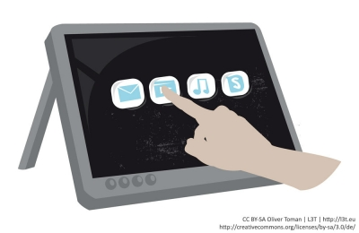

<!-- filename: 09_Touchscreen.md -->
<!-- title: Touchscreen -->

Die ersten Touchscreens wurden schon 1940 entwickelt und schließlich mit Veröffentlichung der PLATO-IV-Lernmaschinen 1972 publik gemacht. Bei Touchscreens interagiert man mit einem Computer durch Berührung des Bildschirmes. Statt der Bedienung durch einen mit der Maus bewegten Cursor, wird auf direkte Eingaben mit Finger und Zeigestift (einem sogenannten Stylus) gesetzt.

<figure>
  
  <figcaption>Abb. 6: Touchscreen</figcaption>
</figure>

Früher vorwiegend bei Info-Monitoren, Computer-Kiosks und Bankomaten verwendet, finden wir Touchscreens heutzutage in Mobiltelefonen, Tablet-PC, Laptop, MP3-Player und Ähnlichem. Man unterscheidet folgende Funktionsprinzipien:

- **Resistive Touchscreens:** Wenn zwei elektrisch leitfähige Schichten per Druck aneinander geraten, entsteht ein Spannungsteiler, an dem der elektrische Widerstand und so die Position der Druckstelle gemessen wird. Verwendung findet diese Technologie bei Kiosksystemen, Tablet-PCs oder Industrie-PCs.
- **Kapazitive Touchscreens:** Bei kapazitiven Touchscreens werden mit Metalloxid beschichtete Glassubstrate oder zwei Ebenen aus leitfähigen Streifen verwendet. Bei der ersten Methode wird ein elektrisches Feld erzeugt, bei dem die elektrischen Ströme aus den Ecken im direkten Verhältnis zur Berührungsposition stehen. Bei der zweiten Methode bilden die zwei Ebenen Sensor und Treiber. Bei Berührung verändert sich die schwache Kapazität des Kondensators und ein größeres Signal kommt beim Sensor an. Verwendung findet diese Technologie bei den Apple-Produkten (iPhone, iPad, iPod) sowie bei Mobiltelefonen von HTC und Samsung.

- **Induktive Touchscreens:** Diese Technologie findet vor allem bei Grafiktablets Verwendung. Die Technik basiert auf elektromagnetischer Basis ohne direkten Bildschirmkontakt. Ein spezieller Stift (Stylus) muss eingesetzt werden, um Interaktion mit dem Bildschirm zu erkennen. Er kommuniziert über hochfrequente Signale mit sehr kleinen Antennenspulen in der Sensor-Leiterplatte. Dabei ist eine sehr exakte Positionsbestimmung über den Resonanzkreis möglich.
- **Optische Touchscreens:** Es kommen Lampen und lichtempfindliche Sensoren zum Einsatz. Wird durch Berührung das Lichtschranken-Gitter durchbrochen, kann der Punkt der Berührung ermittelt werden. Diese Technologie ist sehr fehleranfällig, da Staub auf die Sensoren gelangen und unerwünschte Reaktionen hervorrufen kann. Zum Einsatz kommen optische Touchscreens vor allem bei großen Bildschirmen. Als bekanntestes Beispiel sei auf das Produkt „Microsoft Surface“ verwiesen.

<blockquote style="background: #E8F5E9; border-left: 10px solid #4CAF50">

### In der Praxis

Die kapazitiven Touchscreens haben sich inzwischen flächendeckend durchgesetzt. Die großen Nachteile, dass man sie nicht per Handschuh bedienen kann und die größere Ungenauigkeit, spielen in der Praxis kaum eine Rolle. Dafür sind sie verschleißfrei, unterstützen Multi-Touch und reagieren beim Transport in der Hosen oder Handtasche nicht ungewollt auf Druck. Die große Ausnahme sind jedoch die Samsung-Galaxy-Note-Hybrid-Modelle, die beide Technologien unterstützen. Es wird die kapazitive Technik für die Handeingabe verwendet und die induktive für den Pen, wobei die induktive Technik eine höhere Priorität hat.

</blockquote>
