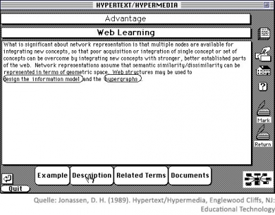

<!-- filename: 04_Erfolgreich_verbreitete_Systeme.md -->
<!-- title: Erfolgreich verbreitete Systeme -->

## Guide

Erst Guide (1986) von OWL (Office Workstations Limited) ist das erste kommerziell erfolgreiche Hypertextsystem. **Peter Brown** hatte es bereits 1982 in England an der University of Kent begonnen. Nielsen meinte (1990, 42; 1995, 54ff.), dass Guide den Übergang von einem exotischen Forschungsprojekt zu einer „Realen-Welt“- Anwendung markiere. Guide wurde von OWL zunächst für den Macintosh, später auch für PCs entwickelt. Es orientiert sich am strengsten von allen Systemen am Dokument. Guide stellt Textseiten zur Verfügung, auf denen Textstellen als Verknüpfungen mit unterschiedlicher Bedeutung markiert werden können. Über den Textstellen nimmt der Cursor unterschiedliche Gestalt an und teilt den Benutzer/innen so die Existenz von Verknüpfungen mit. Guide kennt drei Arten von Verknüpfungen: Springen zu einer anderen Stelle im selben oder in einem anderen Dokument, Öffnen eines Notizfensters oder -dialogs über dem aktuellen Text sowie Ersetzen von Text durch kürzeren oder längeren Text (Auffalten, Einfalten). In Version 2 wurde eine Skriptsprache für den Zugriff auf Bildplattenspieler eingebaut.

## HyperCard

Erstes, nachstehendes, Element wird ans Ende der vorherigen Seite gestellt

1987 erschien **Bill Atkinsons** HyperCard. Schon vorher gab es gespannte Erwartungen. Conklin (1987) gab in seinem historischen Überblick über Hypertext-Systeme sogar das Gerücht weiter: „As this article goes to press, there is news that Apple will soon have its own hypertext system, called HyperCards“ (S. 32). Man darf wohl mit Recht behaupten, dass keine andere Software, schon gar keine andere Programmierumgebung, einen derart bedeutsamen Einfluss auf den Einsatz von Computern gehabt hat wie HyperCard. In der Literatur speziell zu Hypertext wird die historische Bedeutung von HyperCard immer wieder betont, obwohl Landow (1992a) sicher Recht hat, wenn er HyperCard und Guide nur als „first approximations of hypertext“ bezeichnet, da die eigentlichen Merkmale von Hypertext wie die Links in Form von durchsichtigen Schaltflächen (Bedienknöpfen) über den Text gelegt werden mussten. 1989 realisierte David Jonassen in HyperCard eine Hypertext-Umgebung über das Thema Hypertext.

<figure>
  
  <figcaption>Abb. 7: Hypertext realisiert unter HyperCard. Quelle: Beispiel aus Jonassen, 1989.</figcaption>
</figure>

