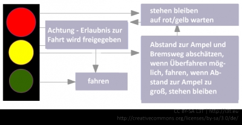

<!-- filename: 04_Lernmanagementsysteme_Lernende_und_Kurse_verwalten.md -->
<!-- title: Lernmanagementsysteme: Lernende und Kurse verwalten -->

Lernmanagementsysteme (LMS) unterstützen vor allem die Kurs- und Benutzer/innen-Verwaltung. Hierzu bieten sie nicht nur einen Rahmen zur Darstellung der Kursinhalte (meist in einem Browser), sondern auch ein Rollen- und Rechtemanagement für die Zugriffskontrolle und stellen verschiedene Werkzeuge für die Kommunikation der Lernenden und Lehrenden bereit (Schulmeister, 2005, 10).

Zu den Anforderungen an Lernmanagementsysteme wird immer wieder festgestellt (Schulmeister, 2005, 55ff.;Niegemann et al., 2008, 499), dass diese stark von der Organisationsstruktur abhängig sind, in der das Lernmanagementsystem eingesetzt werden soll. Von einfachen Systemen zur Bereitstellung und zum Austausch von Dokumenten (zum Beispiel die Groupware BSCW) bis hin zu komplexen Systemen zur lebenslangen Kompetenzentwicklung unterscheiden sich die Plattformen stark in Funktionsumfang, (Administrations-)Aufwand und Kosten.

Bei der Auswahl eines Lernmanagementsystems sollten vor allem folgende Aspekte beachtet werden (Schulmeister, 2005, 58ff.):

Erstes, nachstehendes, Element wird ans Ende der vorherigen Seite gestellt

- Die Möglichkeiten und der Aufwand zur *Administration* des Lernmanagementsystems, zum Beispiel Backup-Möglichkeiten, Abrechnungssysteme für kostenpflichtige Kurse, Benutzer/innen- und Kursverwaltung, Rechte- und Rollenmanagement,
- Unterstützung der *Didaktik* von Lernszenarien, zum Beispiel Werkzeuge zur Kooperation, persönliche Werkzeuge für Lehrende und Lernende (zum Beispiel eigene Notizen, Lesezeichen, Kalender), Lehrplanverwaltung, Erstellung und Auswertung von Tests, Werkzeuge zur Rückmeldung und Bewertung,

- Möglichkeiten zur *Evaluation* der Lernprozesse, zum Beispiel Verfolgung und Analyse von Lernwegen, Erstellung von Reports und Statistiken, Umfragen, Evaluierung von E-Learning-Unterlagen,
- Werkzeuge zur synchronen und asynchronen *Kommunikation*, zum Beispiel Chat, Foren oder Videokonferenzsysteme,
- *Technische Aspekte*, zum Beispiel benötigte Serverkapazitäten, Zugriffsmöglichkeiten über den Webbrowser, Skalierbarkeit, Anbindung an externe Datenbanken und Dienste (zum Beispiel Einschreibelisten des Prüfungsamtes, Personaldatenbanken, Raumverwaltungssysteme oder Semesterapparate der Bibliothek), Unterstützung von Standardformaten wie SCORM, Darstellbarkeit auf mobilen Endgeräten und
- Beachtung *wirtschaftlicher Gesichtspunkte*, wie zum Beispiel Lizenzverträge und -kosten, Support.

<blockquote style="background: #FFEBEE; border-left: 10px solid #F44336">

### ?

Notieren Sie stichpunktartig, wie Sie den Lerninhalt „Wie verhalte ich mich als Autofahrer/in an einer Ampel?“ als Lernmaterial mit einem Autorinnen- und Autorentool umsetzen würden. Dazu werden die notwendigen Informationen in kleine Einheiten zerlegt. Eine mögliche Lösung finden Sie in der Abbildung 6.

</blockquote>

<blockquote style="background: #FFEBEE; border-left: 10px solid #F44336">

### ?

Können die von Ihnen konzipierten Lernmaterialien für Autofahrer/innen, sehende und blinde Fußgänger/innen sowie Rollstuhlfahrer/innen verwendet werden? Notieren Sie stichpunktartig, wie Sie den Lerninhalt „Wie verhalte ich mich an einer Ampel?“ für die neue Zielgruppe als Lernmaterial mit einem Autorinnen- und Autorentool umsetzen würden.

</blockquote>

<figure>
  
  <figcaption>Abb. 6: Mögliche Lösung für die Zerlegung des Lerninhaltes „Wie verhalte ich mich als Autofahrer/in an einer Ampel?“</figcaption>
</figure>

<blockquote style="background: #B3E5FC; border-left: 10px solid #039BE5">

### !

Aspekte, die bei der Auswahl eines Lernmanagementsystems beachtet werden sollten, sind: Administration, Didaktik, Evaluation, Kommunikation, Technik und wirtschaftliche Gesichtspunkte.

</blockquote>

<blockquote style="background: #FFEBEE; border-left: 10px solid #F44336">

### ?

Sie arbeiten in der Personalabteilung eines Unternehmens mit 1.000 Mitarbeiterinnen und Mitarbeitern aus 15 verschiedenen Abteilungen. Ihre Vorgesetzte hat Sie mit der Aufgabe betraut, ein Lernmanagementsystem auszuwählen. Stellen Sie stichpunktartig anhand der obigen Aspekte einen Kriterienkatalog mit K.O.-Kriterien auf, die unbedingt durch das LMS erfüllt werden sollen.

</blockquote>

In Hinblick auf den letzten Aspekt muss oftmals eine Grundsatzentscheidung getroffen werden, ob man sich für eine Open-Source-Lösung oder für ein kommerzielles System entscheidet. Bei Open-Source-Lösungen entfallen zwar die Anschaffungskosten für die Software, jedoch entstehen zumeist höhere Personalkosten sowie laufende Kosten zur Wartung des Systems: Es wird empfohlen, mindestens zwei Mitarbeiter/innen für die Programmiersprache des LMS vor Ort zu haben, um Erweiterungen, Anpassungen und Updates durchführen zu können. Kommerzielle Systeme sind in der Anschaffung oft teuer, Installation und Einweisung sind aber häufig Bestandteil des Kaufvertrags. Zudem sind Supportverträge inklusive Wartungen und Updates üblich.

Neben dem Kriterienkatalog von Schulmeister mit über 150 Unterkategorien (Schulmeister, 2005, 58ff.) sind in der Vergangenheit für die unterschiedlichen Einsatzziele und Bedürfnisse weitere Kriterienkataloge entstanden, nach denen Lernmanagementsysteme bewertet werden können (Baumgartner et al., 2002).

Aspekte ILIAS (Stand: Version 4.3.x) Moodle (Stand: Version 2.5) OLAT (Stand: Version 7.2) Betriebssystem Linux Linux, Windows, Solaris, Mac OS, Netware 6 Linux, Windows, Mac OS X, Solaris, FreeBSD Datenbank MySQL mit DBXML-Unterstützung, z. B. MySQL, PostgreSQL u. a. MySQL, PostgreSQL Skriptsprache PHP PHP Java-Framework mit PHP-basiertem Kurssystem Weitere Voraussetzungen Image Magick ab 6.3.8-3, Info-Zip und Info-Unzip Apache Tomcat Web-Container mit Java-SDK

</blockquote>

Tab.3: Technische Anforderungen von gängigen Open-Source-LMS. Quelle: Dokumentationen von ILIAS (ILIAS, 2013), Moodle (Moodle, 2013) und OLAT (OLAT, 2013)

<blockquote style="background: #FFEBEE; border-left: 10px solid #F44336">

### ?

Welche technischen Anforderungen benötigen die gängigen Open-Source-LMS? Vergleichen Sie Ihre Ergebnisse mit der Darstellung in Tabelle 3.

</blockquote>
