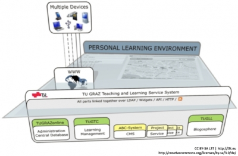

<!-- filename: 05_Vor_Gebrauch_gut_schuetteln_-_Syndikation_und_Integration.md -->
<!-- title: Vor Gebrauch gut schütteln — Syndikation und Integration -->

Moderne Webapplikationen verdanken ihre Verbreitung großenteils der Tatsache, dass ihre Verknüpfung zentraler Bestandteil ihrer Funktionalität ist. Diese Verknüpfung (Syndikation) geht über einfache Hyperlinks weit hinaus: Inhalte und Funktionalitäten werden zur Verfügung gestellt und in andere Web-Applikationen integriert. So wird eine Kreativität bei der Erstellung von neuen Applikationen ermöglicht, wie sie ohne diese Offenheit und den daraus resultierenden Vorteil, bestehende Funktionalität nicht erneut selbst implementieren zu müssen, nur schwer vorstellbar wäre. Die Syndikation mehrerer fremder Funktionalitäten oder Integration fremder Inhalte in eine Webapplikation werden als **Mashup** bezeichnet. Dieser Begriff wurde ursprünglich in der Musikbranche verwendet, um Remixes zu beschreiben. Im Zusammenhang von Webapplikationen bedeutet er eine in der Anwendung transparente Integration fremder Dienste und Inhalte.

Damit sind jedoch auch Nachteile verbunden:

- Wer haftet bei sicherheitskritischen Anwendungen, wenn Funktionen nicht korrekt funktionieren, zum Beispiel wenn bei Lernsoftware eine Applikation die Prüfungsfragen falsch auswertet?
- Alle Server, welche die Services anbieten, müssen ständig verfügbar sein – dies liegt jedoch nicht in der Verantwortung der Betreiber/innen.
- Das Urheberrecht bzw. die Lizenzierung führt zu der Frage, ob man die Funktionen überhaupt integrieren darf.

<blockquote style="background: #B3E5FC; border-left: 10px solid #039BE5">

### !

Ein Mashup ist die Integration von Inhalten und Funktionalitäten anderer Webapplikationen in die eigene.

</blockquote>

## Programmierschnittstellen

**Application Programming Interfaces (API)** sind wohldefinierte Schnittstellen für die Interaktion mit Applikationen. Im Zusammenhang mit Webapplikationen werden sie üblicherweise als Webservices (siehe oben) implementiert und liefern entweder XML-Daten oder vergleichbar strukturierte Daten, zum Beispiel nach der einfacheren JavaScript Object Notation (JSON). Sowohl SOAP als auch REST-Ansätze sind möglich, auch wenn der Trend der letzten Jahre in Richtung REST-Anwendungen weist.  
Einerseits können APIs dazu verwendet werden, um Funktionalität zur Verfügung zu stellen, wie zum Beispiel die Darstellung von Koordinaten in Karten mittels der Google-Maps-API (siehe Beispiel in Abbildung 3). Andererseits können solche Applikationen auch Inhalte zur Verfügung stellen. So ist es mit der Flickr-API zum Beispiel möglich, auf Fotos des Internetdienstes zuzugreifen. Andere APIs ermöglichen beispielsweise die Integration von Daten aus sozialen Netzwerken, wie die Facebook-API.

<figure>
  
  <figcaption>Abb. 1: TUGeowiki: Integration von Kartenmaterial über die GoogleMaps API. Quelle: Safran und Zaka, 2008</figcaption>
</figure>

## RSS

**Real Simple Syndication (RSS)** beschreibt eine Technologie, mit deren Hilfe Inhalte von Websites, sogenannte Feeds, zur Verfügung gestellt werden. Die Daten liegen hierbei in einem XML-Format vor. RSS dient hauptsächlich zur Benachrichtigung bei häufig aktualisierten Informationen, wie Weblogs oder Nachrichtenseiten. Benutzer/innen können RSS-Feeds mit einem Client (z.B. auch einem Mailprogramm) abonnieren, der ihnen immer die jeweils neuesten Meldungen anzeigt. In Webapplikationen bietet RSS eine gute Möglichkeit zur Syndikation von Daten aus unterschiedlichen Quellen. Da die Daten in XML vorliegen, können sie einfach maschinell weiterverarbeitet und in die eigene Webseite integriert werden.

## Widgets

Eine dritte Technologie, die bei der Integration verschiedener Webanwendungen Anwendung findet, sind **Widgets**. Widgets sind kleine, in sich abgeschlossene Programme, die im Rahmen einer anderen grafischen Benutzeroberfläche ablaufen. Die Funktionalität solch eines Widgets ist üblicherweise spezialisiert und eingeschränkt. Im Desktop-Bereich haben sich Widgets inzwischen bei den meisten Betriebssystemen durchgesetzt und können entweder direkt als Teil des Desktops (wie Minianwendungen in Microsoft Windows) oder über eine getrennte WidgetEngine (wie das Dashboard bei Mac OS X) benutzt werden.

Im Zusammenhang mit Webapplikationen bezeichnet der Begriff Widget genauso eine eigenständige, abgeschlossene und in eine andere Applikation integrierte Funktionalität. Diese sind meist innerhalb der Benutzer/innen-Schnittstelle der eigentlichen Webapplikation mehr oder weniger frei positionierbar. So können Widgets zum Beispiel Daten über einen RSS-Feed abrufen oder auf Funktionalitäten mittels einer API zugreifen. Ein Beispiel für Widgets sind die Apps des sozialen Netzwerks Facebook, welche nicht selbst von Facebook, sondern von anderen Entwicklerinnen und Entwicklern erstellt, aber in die Webapplikation Facebook integriert werden. Für Benutzer/innen ist kaum ein Unterschied erkennbar. Über eine API greifen diese Apps zusätzlich auf die Funktionalität von Facebook zu.

Die Personal Learning Environment an der TU Graz

ls Praxisbeispiel für ein Mashup kann die Personal Learning Environment (PLE) an der Technischen Universität Graz genannt werden (Taraghi &amp; Ebner, 2012). In dieser persönlichen Lernumgebung sind verschiedene, zum Teil unabhängige und verteilte Dienste der TU Graz sowie andere Webanwendungen aus dem Internet integriert. Abbildung 2 stellt dieses Grundkonzept graphisch dar. Universitätsdienste wie das Administrationssystem (TUGRAZ.online), LMS (TUGTC), Blogosphere (TUGLL) und viele Lernobjekte für unterschiedliche Lehrveranstaltungen sind in der PLE kombiniert (Ebner et al., 2011).  
Zusätzlich dazu können zahlreiche fremde Lernobjekte und webbasierte Dienste wie Google-Applikationen, Flickr, YouTube, Twitter, Facebook etc. integriert werden. Die Integration dieser Dienste erfolgt mittels der angebotenen API und darauf aufbauenden Widgets. Das PLE als eine Rich Internet Application (RIA) bietet ein Mashup von Widgets, die an die persönlichen Nutzungsbedürfnisse anpassbar sind. Neben einer Portierung dieser Widgets für mobile Endgeräte ist auch eine inter-Widget-Kommunikation möglich. Ein Widget kann mit einem anderen gekoppelt sein, in dem es zum Beispiel auf Google Maps eine Stadt sucht und das Wetter-Widget automatisch für diese Stadt die Wetterprognose anzeigt. Die Benutzer/innen sind in der Lage, sich die geeigneten, zu ihrem Studium benötigten Widgets auszusuchen und diese nach ihren aktuellen Bedürfnissen zu konfigurieren.

<figure>
  
  <figcaption>Abb. 2: PLE: Ein Mashup von Widgets ermöglicht die Integration von verschiedenen Universitätsdiensten sowie der fremden Ressourcen aus dem Internet.</figcaption>
</figure>

