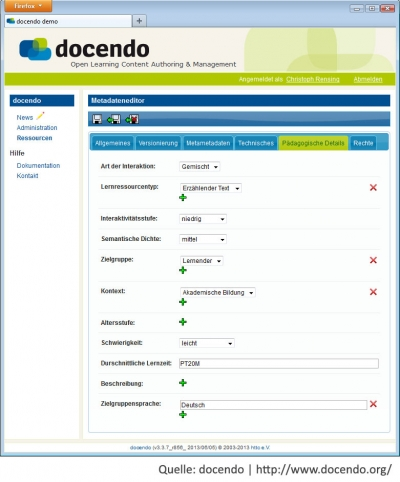

<!-- filename: 02_Metadaten.md -->
<!-- title: Metadaten -->

## Aufgaben von Metadaten

Metadaten sind Daten, die andere, in der Regel größere Daten wie Dokumente, Bilder oder Videos beschreiben bzw. deren Eigenschaften zusammenfassen. Der Zweck von Metadaten besteht insbesondere darin, die eigentlichen Daten zu suchen, ohne sich die Daten selbst ansehen zu müssen. Metadaten werden traditionell in Bibliothekskatalogen zur Beschreibung von Büchern oder Zeitschriften verwendet. Bestandteile von Metadaten sind dann beispielsweise die Autorin bzw. der Autor, der Titel, das Erscheinungsjahr, aber auch Schlagworte, die den Inhalt der Veröffentlichung beschreiben.

Auch elektronische Dokumente werden mit Metadaten beschrieben, um sie zielgerichteter auffinden zu können. Anstelle einer Suche über die Inhalte des Dokumentes selbst, werden die Metadaten durchsucht.

<blockquote style="background: #FFEBEE; border-left: 10px solid #F44336">

### ?

Überlegen Sie sich, wo Sie selbst bereits elektronische Dokumente mit Metadaten beschrieben haben oder mittels Metadaten gesucht haben. Mögliche Lösungen finden Sie in auf diigo.com unter #metadaten #musterloesungen.

</blockquote>

## Learning Object Metadata

Zur Beschreibung von Lehr- und Lernressourcen dienen die *Learning Object Metadata* (LOM). Der LOM-Standard IEEE 1484.12.1 (IEEE, 2002) wurde 2002 vom IEEE LTSC veröffentlicht. Er definiert ein Datenmodell, bestehend aus verschiedenen Attributen zur Beschreibung von Lehr- und Lernressourcen sowie einem bei der Beschreibung zu verwendenden Vokabular. Die mehr als 80 Attribute sind in neun inhaltlich zusammengehörigen Kategorien gegliedert (vgl. Abbildung 2).

<figure>
  
  <figcaption>Abb. 2: Attribute von Learning Object Metadata</figcaption>
</figure>

Unter anderem gibt es eine Kategorie *Educational*, die beispielsweise die Attribute *Typ der Lernressource* oder *Schwierigkeitsgrad* enthält. Für diese Attribute wird ein Vokabular definiert, aus dem ausgewählt werden muss. Beispielsweise gibt es die Schwierigkeitsgrade *sehr leicht, leicht, mittel, schwer* und *sehr schwer* und die Typen *Übung, Tabelle, Experiment, erzählender Text*, etc. LOM ist von hoher praktischer Relevanz, denn der LOM-Standard wird mittlerweile von nahezu allen Lernmanagementsystemen (#infosysteme), Lerncontentmanagementsystemen (#infosysteme), vielen Repositories, wie beispielsweise *Global Learning Object Brokered Exchange* (GLOBE), und vielen Autorensystemen (#infosysteme) für Lernressourcen unterstützt. Abbildung 3 zeigt beispielhaft einen Editor zur Erstellung von Metadaten nach dem LOM-Standard.

Erstes, nachstehendes, Element wird ans Ende der vorherigen Seite gestellt

<figure>
  
  <figcaption>Abb. 3: Metadateneditor der Open-Learning-Content-Plattform docendo</figcaption>
</figure>

<blockquote style="background: #FFEBEE; border-left: 10px solid #F44336">

### ?

Wählen Sie eine von Ihnen erstellte Lernressource und beschreiben Sie diese mit den LOM-Attributen der Kategorie Educational. Eine Beschreibung der einzelnen Attribute finden Sie in (IEEE, 2002). Bei der Bearbeitung der Aufgabe werden Sie feststellen, wie aufwändig die Beschreibung der Lernressource ist.

</blockquote>

## Herausforderungen in der Nutzung von Learning Object Metadata

### In der Praxis hat sich herausgestellt, dass die Auszeichnung von Lernressourcen mittels Metadaten nach dem LOM-Standard nur mit Einschränkungen geschieht. Autorinnen und Autoren von Lernressourcen sind keine Spezialistinnen bzw. Spezialisten in der Erstellung von Metadaten, wie es beispielsweise Bibliothekarinnen und Bibliothekare sind, und ein Anreiz für die Erstellung von umfangreichen Metadaten ist oftmals nicht gegeben. LOM selbst hat sich einerseits als zu umfangreich herausgestellt, viele Attribute werden nicht gefüllt (Ochoa et al., 2011), andererseits wird aber die Aussagefähigkeit insbesondere hinsichtlich der didaktischen Merkmale als zu gering eingeschätzt (Arnold et al., 2003).

Um mit diesen Herausforderungen umzugehen, wurden vermehrt anwendungsspezifische LOM-Profile definiert, in denen eine Organisation definiert, bei welchen Attributen es sich um Pflichtfelder handelt, wie die Attribute zu verwenden sind oder welche Werte für einzelne Attribute verwendet werden können. Alternativ zum LOM-Standard wird, unter anderem aufgrund dessen Komplexität, häufig auch der *Dublin Core Standard* (Dublin Core, 2012) zur Beschreibung von Lehr-/Lernressourcen genutzt. *Dublin Core* dient allgemein zur Beschreibung von digitalen Objekten und wird vielfach von digitalen Bibliotheken verwendet. Es umfasst nur 15 Kernelemente, die um speziellere Elemente erweitert werden können.
