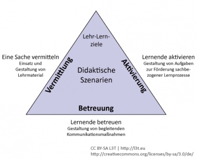

<!-- filename: 03_Eine_Handlungslogik_fuer_die_Gestaltung_didaktischer_Szenarien.md -->
<!-- title: Eine Handlungslogik für die Gestaltung didaktischer Szenarien -->

Wenn man weder aus Lerntheorien *ableiten* kann, wie man am besten lehrt, noch vom Didaktischen Design *eindeutige Regeln* für die Gestaltung didaktischer Szenarien mit Lernerfolgsgarantie erhält, stellt sich für die Lehr-Lernpraxis die Frage: Woran orientiert man sich beim didaktischen Handeln? Gibt es richtungsweisende Strategien aus dem Didaktischen Design, denen man vertrauen kann? Sind Lerntheorien überflüssig oder nutzen einem deren Kenntnisse am Ende doch etwas? Im Folgenden schlage ich für die Lehr-Lernpraxis eine *didaktische Handlungslogik* für die Unterrichtsplanung vor, in der sowohl lerntheoretische und didaktische Kenntnisse hilfreich sind als auch einfache Verfahrensempfehlungen für die Gestaltung didaktischer Szenarien möglich erscheinen.

## Bestimmung von Lehrzielen als Ausgangspunkt

Ausgangspunkt aller Planungen sind in der Regel die Ziele, die Lehrende haben oder aufstellen müssen, wenn sie einen Unterrichtsentwurf oder Entwürfe für technologiegestützte Lehr-Lernangebote erarbeiten wollen. Man kann darüber streiten, ob man besser von Lernzielen statt von Lehrzielen sprechen sollte. Ich halte im Kontext des organisierten Lernens den Begriff der *Lehrziele* für treffender, da Zweck und Ziele in Bildungsinstitutionen genau nicht oder nur in begrenztem Umfang seitens der Lernenden selbst formuliert werden können. Lernende haben Einfluss auf die Ziele, falls sie Optionen bei der Wahl von Bildungsinstitutionen und dortigen Angeboten haben. Zudem sollte man natürlich Lehrziele verständlich vermitteln und damit rechnen, dass Lernende Lehrziele nicht in der Gänze als ihre Lernziele übernehmen (vgl. Klauer &amp; Leutner, 2007, 22 ff.). Im besten Fall lassen sich Lehrziele an Bedürfnisse oder Erwartungen von Lernenden anpassen; wo immer es geht, sollte man Spielräume nutzen, um Lernende an der Festlegung und Ausformulierung von Lehrzielen zu beteiligen.

**Lehrzieltaxonomien.** Lehrzieltaxonomien sind Ordnungsschemata und helfen Lehrenden, indem sie anhand bestimmter Ordnungskriterien Ziele explizit machen und so strukturieren, dass man deren Unterschiede gut erkennt. Ein mögliches Ordnungskriterium ist z.B. der *Abstraktionsgrad* von Lehrzielen, nach dem man konkrete von abstrakten Lehrzielen trennen kann. Ist das Kriterium *inhaltlich*, dann unterscheidet man etwa fachliche von überfachlichen Lehrzielen.

Das Kriterium kann auch verschiedene *Dimensionen des Lernens* heranziehen und kognitive, emotional-motivationale und motorische Lehrziele postulieren. Innerhalb einer Lehrzielkategorie wird häufig das Kriterium *Schwierigkeits- oder Komplexitätsgrad* herangezogen. Manche Lehrzieltaxonomien kombinieren zwei Ordnungskriterien und kommen auf diesem Wege zu einer Matrix. Dies ist auch bei der Lehrzieltaxonomie von Anderson und Krathwohl (2001) der Fall, die sich zwar ausschließlich auf kognitive Lehrziele beschränkt, aber seit längerem besonders verbreitet ist (siehe Tab. 1). Euler und Hahn (2007, 135 ff.) versuchen, die auf Wissen reduzierte Sicht von Anderson und Krathwohl (2001) mit Fertigkeiten (Können) und Einstellungen (Werten) zu ergänzen und verschiedenen Kompetenzbereichen (Sach-, Sozial- und Selbstkompetenzen) zuzuordnen. Deutlich wird hier, dass bisherige Lehrzieltaxonomien der aktuellen Kompetenzorientierung noch nicht angemessen nachgekommen sind.

Dimension Wissen Dimension kognitive Prozesse Erinnern Verstehen Anwenden Analysieren Bewerten Erschaffen Faktenwissen Konzeptwissen Prozesswissen Metakognitives Wissen

</blockquote>

Tab.1: Revision der Bloomschen Taxonomie nach Anderson und Krathwohl (2001)

Mit Hilfe von Lehrzieltaxonomien können sich Lehrende leichter bewusst machen, was sie mit ihrem Unterricht erreichen wollen, welchen Zieltypus sie verfolgen, woran sie noch nicht gedacht haben etc. Innerhalb von Bildungsinstitutionen unterstützen Lehrzieltaxonomien außerdem die Gestaltung von Prüfungen. Lehrzieltaxonomien können aber auch Nachteile haben: Man muss sich klar machen, dass diese von den lerntheoretischen Strömungen geprägt sein können, zu deren Zeit sie entstanden sind. In der Regel sind Lehrzieltaxonomien behavioristisch (mit Blick auf beobachtbares Verhalten) oder kognitivistisch (unter Ausklammerung anderer als kognitiver Ziele) beeinflusst. Lehrzieltaxonomien legen mitunter nahe, nur solche Ziele zu verfolgen, die sich eindeutig operationalisieren lassen, was Bildungsangebote unangemessen einengen kann. Zudem sind Lehrzieltaxonomien keine Hilfe bei der Frage, wie man zum eigentlichen Gegenstand des Lehrens und Lernens, den Inhalten, kommt.

**Von Zielen zu Inhalten.** Fragen zur Inhaltsauswahl werden im Didaktischen Design nicht immer ausreichend thematisiert. Allerdings sind Wissen, Können und Einstellungen, mithin auch Kompetenzen, immer an Inhalte gebunden. Daher ist es angesichts eines in der Regel begrenzten Zeitraums für Lehren und Lernen durchaus bedeutsam, sich bei der Gestaltung didaktischer Szenarien auch Gedanken über notwendige, sinnvolle oder wünschenswerter Inhalte zu machen. Hierzu gibt es mehrere Prinzipien (vgl. Euler und Hahn, 2007, 126 ff.):

- Im Kontext des ISD werden z.B. Bedarfsanalysen vorgeschlagen: Aktuelle Anforderungen in beruflichen Kontexten definieren dann z.B., welche Inhalte in einem Unterricht aufgenommen werden sollten (*Situationsprinzip*).
- Man kann sich aber auch an wissenschaftlichen Erkenntnissen orientieren und auswählen, was sich als besonders gut erwiesen hat und/oder als besonders relevant eingeschätzt wird (*Wissenschaftsprinzip*).
- Allgemeine Didaktiker/innen legen als Auswahlstrategie nahe, exemplarisch vorzugehen (*Bildungsprinzip*): Statt einer hohen Stofffülle werden diejenigen Inhalte priorisiert, die nicht nur für sich sprechen, sondern gewissermaßen über sich hinausgehen und stellvertretend auch für etwas anderes (nämlich Bildungsrelevantes) stehen (vgl. Zierer, 2012, 93 f.).

## Gestaltung didaktischer Szenarien

Denen, die nicht wissen, welche Ziele sie verfolgen wollen, fehlt der Richtungsweiser bei der Gestaltung eines didaktischen Szenarios. Von daher bilden die Lehr-Lernziele – in Kombination mit den bestehenden Rahmenbedingungen – den Ausgangspunkt im Didaktischen Design. Eng damit verbunden sind inhaltliche Entscheidungen. Die eben angesprochenen Inhalte bilden die *materiale* Seite des Lehrens, die allein allerdings zu einem bloßen Informationsangebot führen würde; hinzukommen muss eine prozessuale und soziale Seite (vgl. Reinmann, 2013). Mit anderen Worten: Ausgehend von den Zielen (und Rahmenbedingungen) muss man sich bei der Gestaltung eines didaktischen Szenarios immer um folgende drei Dinge Gedanken machen: erstens um die Frage, wie man eine Sache *vermittelt* (materiale Seite), zweitens um die Frage, wie man Lernende *aktiviert*, sich mit der Sache auseinanderzusetzen, (prozessuale Seite) und drittens um die Frage, wie man Lernende dabei begleitet bzw. betreut (soziale Seite).

Je nach Zielsetzung können diese drei Komponenten des Lehrens unterschiedliches Gewicht haben und entsprechend unterschiedliche (auch zeitliche) Anforderungen an den Planungs- und Entwurfsprozess stellen. Diese Überlegungen entlang der Logik didaktischen Handelns können eine Art Grundfigur für das Didaktische Design bilden (siehe Abb. 1).

Abb.1: Grundfigur für das Didaktische Design

**Vermittlung.** Inhalte zu *vermitteln* bedeutet, bestehendes Wissen in irgendeiner Form darzustellen und weiterzugeben – und das in allen denkbaren Formaten: als gesprochenes und geschriebenes Wort, als Audio und Video, als Bild und Animation etc. Speziell für technologiegestütztes Lehren und Lernen sind der Gestaltung (auch der interaktiven) nur mehr wenige Grenzen gesetzt (vgl. z.B. Niegemann, Domag, Hessel, Hein, Hupfer &amp; Zobel, 2008). Für die Gestaltung medialer Inhalte sind lernpsychologische Erkenntnisse brauchbar: unter anderem solche, die (nicht nur, aber besonders) unter dem Dach kognitivistischer Lerntheorien entstanden sind. Lehrende produzieren für ihren Unterricht in der Regel nicht alle medialen Inhalte selbst. Unter Umständen bedienen sie sich sogar komplett bereits bestehender Ressourcen; doch auch für diese Entscheidungen sind sowohl lerntheoretische als auch didaktische Kenntnisse nützlich. Bei der *Gestaltung der materialen Seite* eines didaktischen Szenarios geht es um die Bestimmung der Art und des Anteils der Vermittlung: Der Vermittlungsanteil kann groß, aber auch klein sein – in Abhängigkeit von den Lehrzielen und sonstigen Bedingungen. So wird man sich z.B. in Projektveranstaltungen auf ein paar Texte oder Videos beschränken – möglicherweise auf solche, die authentische Informationen zum Projektgegenstand liefern. Dagegen wird man in einer Produktschulung einen hohen Vermittlungsanteil im didaktischen Szenario haben und diesen womöglich auch aufwändig interaktiv und anschaulich gestalten.

**Aktivierung.** Der bloßen Vermittlung sind in der Lernförderung enge Grenzen gesetzt. Es gehört zu den besonders schwierigen Aufgaben, didaktische Szenarien so zu gestalten, dass Lernende auch *aktiviert* werden, sich mit den Lehrinhalten intensiv auseinanderzusetzen. Dazu dienen verschiedene Aufgaben: (a) solche, mit denen man Kenntnisse oder Fertigkeiten einüben oder trainieren kann, (b) solche, die Lernende anregen, sich (z.B. mit Strukturierungshilfen, verschiedenen Gesprächsformen oder Modellen/Vorbildern) Wissen zu erschließen, (c) solche, bei denen vorgegebene Inhalte von den Lernenden transformiert werden (etwa bei Problemstellungen oder Fallstudien, beim „Lernen durch Lehren“ etc.) oder (d) solche, mit deren Bearbeitung gänzlich neues Wissen und Können entsteht, das man vorab nicht im Detail hat planen können (Projekt-, Designaufträge). Für die Aufgabengestaltung sind lernpsychologische Kenntnisse aus allen lerntheoretischen „Lagern“ hilfreich. Je mehr didaktische Modelle man kennt, umso größer wird der Ideenpool für kreative Formen der Aktivierung. Auch lerntheoretische Kenntnisse sind hilfreich, um sich ein Bild von der Art möglicher Aktivierung machen zu können. Bei der *Gestaltung der prozessualen Seite* eines didaktischen Szenarios geht es um die Bestimmung der Art und des Anteils direkter Anleitung und Unterstützung und/oder indirekter Ermöglichung von Lernprozessen: Der Aktivierungsanteil kann vielfältig und umfänglich oder fokussiert und klein sein – wiederum in Abhängigkeit von den Zielen.

**Betreuung.** Gerade beim technologiegestützten Lehren und Lernen, das man gerne mit einer Effizienzsteigerung in der Bildung in Verbindung bringt, ist es schließlich eine höchst relevante Frage, wie es um die Art und den Anteil der *Betreuung* in einem didaktischen Szenario bestellt ist. In Abhängigkeit von Zielen, Inhalten und vor allem auch Rahmenbedingungen (Anzahl der Lernenden, zeitliche Ressourcen etc.) müssen Lehrende neben der Gestaltung der Vermittlung und Aktivierung didaktische Entscheidungen in punkto Begleitung bzw. Betreuung der Lernenden treffen. In diesem Zusammenhang ist z.B. das Feedback auf Lernergebnisse und Lernprozesse zu nennen, aber auch die Gestaltung tutorieller Unterstützung (z.B. Einsatz von Tutorials oder Tutorinnen und Tutoren) und sozialer Räume (Lerngemeinschaften, soziale Netzwerke etc.). Im weitesten Sinne geht es hier um die *Gestaltung der* *sozialen Seite* didaktischer Szenarien. Lerntheorien könnten hier unter anderem durch ihre Menschenbilder Einfluss auf Gestaltungsentscheidungen vor allem auf der Mikroebene nehmen.

<blockquote style="background: #B3E5FC; border-left: 10px solid #039BE5">

### !

**Fazit:** Didaktischer Szenarien, die man nach der vorgeschlagenen Handlungslogik kreiert, kommen als Unterrichtsentwürfe zum Ausdruck, die Folgendes beinhalten: (a) Angaben zu den Lehrzielen einschließlich des inhaltlichen Rahmens, in dem man sich bewegt (Inhaltsbeschreibung), (b) eine Skizze, wie man die Vermittlung, Aktivierung und Betreuung umsetzen will und wie diese drei Komponenten des Lehrens (bezogen auf die Gewichtung wie auch Ausgestaltung) strukturell zusammenspielen (Strukturbeschreibung), und (c) Informationen darüber, in welchen Phasen eine Unterrichtseinheit über die Zeit abläuft (Verlaufsbeschreibung).

</blockquote>
