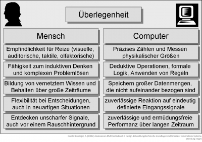

<!-- filename: 03_Grundregeln_fuer_benutzergerechte_HCI.md -->
<!-- title: Grundregeln für benutzergerechte HCI -->

## Unterschiede Mensch-Computer

Wenn wir uns mit der Interaktion, Perzeption und Kognition von Information durch den Menschen beschäftigen,müssen wir einige wesentliche Unterschiede zwischen Mensch und Computer kennen. Während Menschen die Fähigkeit zum induktiven, flexiblen Denken und komplexen Problemlösen auszeichnet, zeigen Computer bei deduktiven Operationen und logischen Aufgaben ermüdungsfreie Performanz (Bild 2).

<figure>
  
  <figcaption>Abb. 2: Grober Vergleich Mensch – Computer (Holzinger, 2000c)</figcaption>
</figure>

<blockquote style="background: #B3E5FC; border-left: 10px solid #039BE5">

### !

Usability ist nicht nur die – wie das Wort ins Deutsche übersetzt wird – schlichte „Gebrauchstauglichkeit“. Usability setzt sich nämlich aus Effektivität, Effizienz und der Zufriedenheit der Endbenutzerinnen und Endbenutzer zusammen.

</blockquote>

## HCI und Usability

Zur Interaktion zwischen Mensch und Computer gibt es einige Elemente, die im Folgenden kurz vorgestellt werden. Wichtig ist zu berücksichtigen, dass sowohl funktionale als auch ästhetische Elemente zusammenwirken sollten. Brauchbarkeit (usefulness), Benutzbarkeit (usability) und Ästhetik (enjoyability) sollten ausgewogen zusammenwirken.

**Usability – was ist das eigentlich?** Usability ist nicht nur die – wie das Wort ins Deutsche übersetzt wird – schlichte „Gebrauchstauglichkeit“. Usability setzt sich nämlich aus Effektivität, Effizienz und der Zufriedenheit der Endbenutzerinnen und Endbenutzer zusammen. Effektivität wird daran gemessen, ob und in welchem Ausmaß die Endbenutzerinnen und Endbenutzer ihre Ziele erreichen können. Effizienz misst den Aufwand, der zur Erreichung dieses Ziels nötig ist. Zufriedenheit schließlich ist gerade im E-Learning wichtig, denn sie enthält subjektive Faktoren wie „joy of use“, „look &amp; feel“ und „motivation &amp; fun“ (enjoyability). Usability wird demnach durch das optimale Zusammenspiel von Effektivität, Effizienz und Zufriedenheit für einen bestimmten Benutzerkontext gemessen.

In den folgenden Aufzählungen soll exemplarisch klar werden, worauf es in der Usability ankommt:

1. Orientierung. Elemente wiebeispielsweise Übersichten, Gliederungen, Aufzählungszeichen, Hervorhebungen oder Farbbereiche dienen dazu, sich zurechtzufinden. Die Endbenutzerinnen und Endbenutzer müssen stets zu jeder Zeit genau erkennen, wo sie sich befinden und wo sie „hingehen“ können.
2. Navigation (zum Beispiel Buttons, Links oder Navigationsleisten) helfen den Benutzerinnen und Benutzern, sich zu bewegen und gezielt bestimmte Bereiche anzuspringen. Die Navigation muss logisch, übersichtlich, rasch und konsistent (immer gleichartig) erfolgen. Sprichwort: „Whatever you do, beconsistent“ Das gilt auch für Fehler: Solange sie konsistent sind, fallen sie nicht so sehr auf.
3. Inhalte (zum Beispiel Texte, Bilder, Töne, Animationen, Videos) sind die Informationen, die vermittelt werden sollen (engl. „content“). Hier gelten alle Grundregeln der menschlichen Informationsverarbeitung. Alle Inhaltselemente müssen entsprechend aufbereitet werden. Text muss kurz und prägnant sein. Anweisungen müssen eindeutig und unmissverständlich sein.
4. Interaktionselemente (zum Beispiel Auswahlmenüs, Slider, Buttons) ermöglichen, gewisse Aktionen zu erledigen. Sämtliche Interaktionen müssen den (intuitiven) Erwartungen der Endbenutzerinnen und Endbenutzer entsprechen.

**Usability-Engineering-Methoden sichern den Erfolg.** Eine breite Palette an Usability-Engineering-Methoden (UEM) sichern erfolgreiche Entwicklungsprozesse (sieheHolzinger, 2005). Ein Beispiel hierfür ist das „User-Centered Design“ (UCD). Dieser Ansatz orientiert sich an Bedürfnissen, Fähigkeiten, Aufgaben, Kontext und Umfeld der Endbenutzerinnen und Endbenutzer, die von Anfang an in den Entwicklungsprozess mit einbezogen werden. Daraus entwickelte sich das „Learner-Centered Design“ (LCD), das sich auf die Grundlagen des Konstruktivismus (Lernen als konstruktive Informationsverabeitung) und des Problem-basierten Lernens stützt. Ähnlich wie beim UCD fokussiert sich das LCD auf das Verstehen der Lernenden im Kontext. Die E-Learning-Umgebung (also das Tool) und der Lerninhalt (engl. „content“) müssen einen maximalen Nutzen (Lernerfolg) bringen.

Ähnlich wie im User-Centered Design wird bei dieser Methode ein spiralförmiger (iterativer) Entwicklungsprozess durchlaufen, der aus drei Phasen besteht. In jeder Phase kommen spezielle Usability-Methoden zum Einsatz, die Einblick in die Bedürfnisse, das Verhalten und den Kontext der Endbenutzerinnen und Endbenutzer erlauben (Wer? Was? Wann? Wozu? Wie? Womit? Warum?). So kann eine genaue Kenntnis der Lernenden gewonnen werden: Ziele, Motivation, Zeit, Kultur, Sprache, Voraussetzungen, Vorwissen und weiteres.

<blockquote style="background: #B3E5FC; border-left: 10px solid #039BE5">

### !

„Thinking aloud“ beschreibt eine Methode, bei der zumeist vier bis fünf Testpersonen gebeten werden, ein Programm oder einen Programmablauf zu testen und ihre Gedanken dabei laut auszusprechen.

</blockquote>

Es wird jeweils zum nächsten Schritt übergangen, wenn kein nennenswerter Erkenntnisgewinn mehr erzielt wird. Wichtig ist die interdisziplinäre Zusammenarbeit verschiedener Personen, wie zum Beispiel Fachexperten und Fachexpertinnen, Didaktiker/innen, Multimedia-Experten und -Expertinnen, Usability-Ingenieure und Lernende! Selten fallen alle Rollen in einer Person zusammen. Während der Analysen wird klar, welches didaktische Modell für den jeweiligen Kontext am besten geeignet ist und welche pädagogischen Konzepte angewandt werden können, die die Lernenden im Zielkontext mit der jeweiligen Zieltechnologie (zum Beispiel Mobiltelefon, iPod, iTV) bestmöglich unterstützen.

Mit Hilfe eines ersten Prototyps kann Einsicht in viele Probleme gewonnen werden. Sehr bewährt hat sich das sogenannte „Rapid Prototyping“, das auf papierbasierten Modellen beruht und enorme Vorteile bringt (Holzinger, 2004). Dabei kann das Verhalten der Endbenutzerinnen und Endbenutzer zum Beispiel mit der Methode des Lautdenkens (englisch „thinking aloud“, siehe Infokasten) untersucht werden. Erst wenn auf Papierebene alles „funktioniert“, wird ein computerbasierter Prototyp erstellt, der dann wiederholt getestet wird. Erst wenn auch hier kein weiterer Erkenntnisgewinn erfolgt, kann die Freigabe für die Umsetzung der endgültigen Version gegeben werden. Papier in der Anfangsphase, das klingt seltsam, ist aber extrem praktisch, weil wesentliche Interaktionselemente schnell erstellt und simuliert werden können, ohne dass bereits Programmierarbeit geleistet wird.

<blockquote style="background: #B3E5FC; border-left: 10px solid #039BE5">

### !

Erfolgsregel: Alles, was bereits in der Anfangsphase erkannt wird, spart Zeit und Kosten! Der Return on Investment (RoI) liegt dabei zwischen 1:10 bis 1:100.

</blockquote>

<blockquote style="background: #B3E5FC; border-left: 10px solid #039BE5">

### !

„Bedienerfreundlichkeit“ wird im englischen Sprachraum nicht mit Usability bezeichnet. Der Begriff Usability setzt sich aus zwei Worten zusammen: use (benutzen) und ability (Fähigkeit), wird im Deutschen mit „Gebrauchstauglichkeit“ übersetzt und umfasst weit mehr als nur Bedienerinnen- und Bedienerfreundlichkeit: In der ISO Norm 9241 wird Usability als das Ausmaß definiert, in dem ein Produkt durch bestimmte Benutzer/innen in einem bestimmten Nutzungskontext (!) genutzt werden kann, um deren Ziele effektiv und effizient zu erreichen.

</blockquote>

**Lerninhalt – Metadaten – Didaktik.** Damit E-Learning-Inhalte einem lerntheoretisch adäquaten Ansatz entsprechen, müssen diese nicht nur entsprechend aufbereitete Lerninhalte und Metainformationen (Metadaten sind Informationen die zum Beispiel das Wiederfinden ermöglichen) enthalten, sondern auch noch einige weitere technische Voraussetzungen erfüllen. Ähnlich wie in der objektorientierten Programmierung (OOP), entstand die Grundidee von Lernobjekten, das heißt komplexe Lerninhalte (engl. „content“) in einzelne kleine Objekte aufzuteilen. Wünschenswerte technische Eigenschaften solcher Objekte sind Austauschfähigkeit (engl. „interoperability“) und Wiederverwertbarkeit (engl. „reusability“). Dazu muss das Objekt aber nicht nur Lerninhalte und Metadaten enthalten, sondern auch Fragen zum Vorwissen (engl. „prior knowledge questions“) und zur Selbstevaluierung (engl. „self-evaluation questions”).

Fragen zum Vorwissen haben im Lernobjekt die Funktion von AdvanceOrganizers(Ausubel, 1960). Dabei handelt es sich um einen instruktionspsychologischen Ansatz in Form einer „Vorstrukturierung“, die dem eigentlichen Lernmaterial vorangestellt wird. Allerdings driften hier die Forschungsbefunde auseinander: Die ältere Forschung betont, dass ein Advance Organizer nur dann wirksam wird, wenn dieser tatsächlich auf einem höheren Abstraktionsniveau als der Text selbst liegt, das heißt lediglich eine inhaltliche Zusammenfassung des nachfolgenden Textes ist noch keine Vorstrukturierung. Solche Vorstrukturierungen, die analog zu den Strukturen des Textes aufgebaut sind, bringen bessere Ergebnisse bei der inhaltlichen Zusammenfassung als solche, die zwar inhaltlich identisch, aber nicht in diesem Sinn analog aufgebaut sind. Andererseits hebt die jüngere Forschung hervor, dass sich konkrete, das heißt weniger abstrakt formulierte, Vorstrukturierung auf das Behalten längerer Texte positiv auswirkt. Sie aktivieren demnach das vorhandene Vorwissen und verbinden sich damit zu einer „reichhaltigen Vorstellung“ – einem mentalen Modell (dazu Ausubel, 1968; Kralm &amp; Blanchaer, 1986; Shapiro, 1999). Das Konzept der AdvanceOrganizer ist verwandt mit dem Schema-Modell kognitiver Informationsverarbeitung (Bartlett, 1932). Schemata spielen eine wichtige Rolle bei der sozialen Wahrnehmung, beim Textverstehen, beim begrifflichen und schlussfolgernden Denken und beim Problemlösen. Ähnlich wie Schemata funktioniert die Theorie der Frames und Slots nach Anderson(Anderson et al., 1996). Die Wissensrepräsentation mit Hilfe von Frames stellt eine objektorientierte Wissensrepräsentation dar und zeigt Ähnlichkeiten zwischen menschlichem Gedächtnis und wissensbasierenden Informationssystemen. Objekte der realen Welt werden dabei durch sogenannte Frames dargestellt. Die Eigenschaften der Objekte werden in den Frames in sogenannten Slots (Leerstellen) gespeichert. Der Tatsache, dass es in der realen Welt mehrere unterschiedliche Objekte eines Objekttyps gibt, wird mit Hilfe von generischen Frames und deren Instanzen Rechnung getragen. Ein generischer Frame hält für jedes Attribut, mit dem ein Objekt beschrieben wird, einen Slot bereit. In einer Instanz des generischen Frames wird nun jedem Slot – entsprechend für das Attribut, für das er steht, – ein Wert zugeordnet. Die Beziehung zwischen einem generischen Frame und einer Instanz wird mit Hilfe des „is-a“-Slot hergestellt. Im Beispiel ist im ,,is-a“-Slot gespeichert, dass es sich bei Katharina um ein Kind handelt. In den übrigen Slots sind jeweils Werte zu den Attributen gespeichert. Diese Theorien besagen, dass Lernende besser lernen, wenn die Information assoziativ organisiert ist, da Lernende neue Informationen stets auf alten Informationen (Vorwissen) aufbauen. Bereits Piaget (1961) bezeichnete Schemata als grundlegende Bausteine zum Aufbau von Wissen.

### In der Praxis: Evaluation von Systemen und Software

Für die Praxis ist die Evaluation, also die Beurteilung von Systemen und Software wichtig. Eine Evaluation sollte stets systematisch, methodisch und prozessorientiert durchgeführt werden.  
</blockquote> Es wird unterschieden zwischen formativer Evaluation (während der Entwicklung) und summativer Evaluation (nach der Fertigstellung). Subjektive Evaluation schließt die mündliche und die schriftliche Befragung und das laute Denken ein. Objektive Evaluation bedient sich der anwesenden und abwesenden Beobachtung.  
Bei leitfadenorientierten Evaluationsmitteln wird das Produkt entlang eines Prüfleitfadens beurteilt, der sich aus typischen Aufgaben des Systems ergibt. Bei der Erfassung der Messwerte können verschiedene Skalen (zum Beispiel Nominalskala, Rangskala, Verhältnisskala) verwendet werden, die unter bestimmten Voraussetzungen durch eine Skalentransformation ineinander überführt werden können. Messungen sollen sich stets durch hohe Reliabilität (Zuverlässigkeit), Validität (Gültigkeit) und Objektivität (Sachlichkeit) auszeichnen. Als Beurteilungsverfahren (Zuweisung von Werten) werden Grading (Einstufung), Ranking (Reihung), Scoring (Punktevergabe) und Apportioning (Aufteilung, Zuteilung) verwendet. Eine quantitative Beurteilung (Vorteil: leichte Vergleichbarkeit von Systemen) kann durch Schulnoten erfolgen; oft wird es aber auch umgekehrt gemacht, wobei mehr Punkte besser sind. Multimedia-Systeme können systematisch mit Checklisten beurteilt werden.

**Was bringt Usability?** Ein Usability-orientierter Prozess schafft Erfolgssicherheit, deckt Risiken frühzeitig auf und sichert eine endbenutzerinnen- und endbenutzerzentrierte Entwicklung. Usability-Engineering-Methoden machen nicht nur Probleme sichtbar, sondern generieren in der Entwicklungsphase neue Ideen und Möglichkeiten – denn Usability Engineering stellt den Menschen in den Fokus der Entwicklung.
