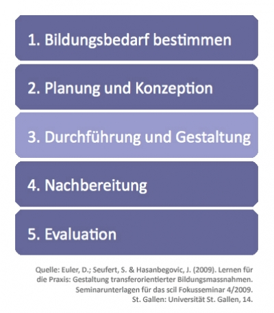

Neben der Unterstützung der Interaktion von Lernenden und Dozierenden lassen sich digitale Technologien auch für eine effektive Planung und Organisation von Bildungsangeboten einsetzen.

<figure>
  
  <figcaption>Abb. 1: Bildungszyklus zur Strukturierung des didaktischen Designs von Lernprozessen</figcaption>
</figure>

Abbildung 1 zeigt mit dem so genannten „Bildungszyklus“ ein heuristisches Modell zur Organisation von Bildungsprozessen entlang von fünf Schritten (Euler et al., 2009). Dieses Modell wird im vorliegenden Beitrag als Ordnungsraster genutzt. Bei jedem Schritt werden Beispiele für einen möglichen Technologieeinsatz vorgestellt. Vorwiegend wird dabei auf den Unternehmenskontext Bezug genommen, wobei die Ausführungen prinzipiell auch auf andere Organisationen übertragen werden können.

Der Fokus dieses Kapitels liegt auf der Unterstützung der Planung und Organisation von Bildungsprozessen durch digitale Technologien. Da in anderen Kapiteln bereits auf die technologiebasierte Durchführung und Gestaltung von Bildungsveranstaltungen in unterschiedlichen Kontexten eingegangen wurde, wird dieser Teil des Bildungszyklus (Abb. 1, Schritt drei) hier nicht weiter behandelt (siehe Kapitel #sekundaruntericht #hochschule).
