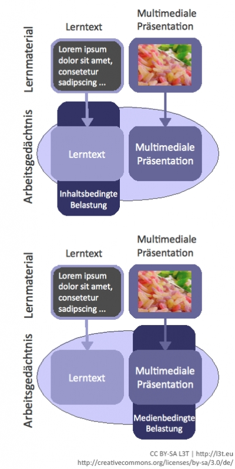

Wenn es zu einer Überschreitung der kognitiven Ressourcen im Arbeitsgedächtnis kommt, dann kann es zu Verstehens- und Speicherungsproblemen kommen. Damit die Informationen adäquat verarbeitet und behalten werden können, spielen eine Vielzahl an Faktoren eine Rolle. Hier gilt es, die Komplexität des zu vermittelnden Inhalts, die mediale Darstellung und Umgebung, die Art und Anzahl an unterschiedlichen Zeichensystemen, die verwendet werden, zu berücksichtigen. Aber auch relevante Eigenschaften der Lernenden, nämlich die verfügbaren kognitiven Ressourcen und auch die zur Verfügung stehende Zeit zur Verarbeitung der Lerninhalte, sind bedeutsam (Schwan &amp; Hesse, 2004).

Wenn wir mit Informationen überfrachtet werden, diese nur schwer oder nicht mehr aufnehmen und verarbeiten können, unterliegen wir der sogenannten kognitiven Belastung. Die **Theorie der kognitiven Belastung** (engl. ‚cognitive load theory‘) bezieht sich auf die beschränkten Ressourcen unseres Arbeitsgedächtnisses (Chandler &amp; Sweller, 1991). Bei einer Überschreitung der zur Verfügung stehenden Ressourcen kommt es zu Verstehens- und Speicherungsproblemen. Diese Belastung ist abhängig von der individuellen Informationsverarbeitungskapazität und der Gestaltung der Lernmaterialien. Die kognitive Belastung wird in drei Unterbereiche gegliedert, in eine intrinsische, eine extrinsische und in eine lernförderliche kognitive Belastung.  

- **Intrinsische kognitive Belastung** (engl. ‚intrinsic cognitive load‘): Diese ist abhängig vom Lerninhalt. Je komplexer und schwieriger der Lerninhalt für die Lernenden ist, desto mehr müssen kognitive Ressourcen in Anspruch genommen werden. Ein wesentlicher Einflussfaktor stellt hierbei die Element-Interaktivität dar. Darunter versteht man die Anzahl der unterschiedlichen zusammenhängenden Lerninhalte, die erfasst werden müssen, um den ganzen Sachverhalt verstehen zu können (zum Beispiel das Ökosystem der Erde). Das Vorwissen der Lernenden spielt auch eine wichtige Rolle. Je höher der Kenntnisstand im jeweiligen Inhaltsbereich und je vertrauter die Lernenden mit den Inhalten sind, desto leichter kann die Wissensverarbeitung stattfinden.

- **Extrinsische kognitive Belastung** (engl. ‚extraneous cognitive load‘): Eine weitere Rolle bei der Beanspruchung der kognitiven Ressourcen spielt die ungünstige Darstellung der Lerninhalte, die mediale Präsentation. Diese Belastungsform bezieht sich auf irrelevante, unnötige Aktionen, die nichts mit den Lerninhalten zu tun haben. So kann zum Beispiel ein zum Text gehöriges Bild zu weit davon entfernt sein. Stattdessen sollen die zusammengehörigen Informationen integriert präsentiert werden.

- **Lernförderliche kognitive Belastung** (engl. ‚germane cognitive load‘): Diese kognitive Belastung klingt etwas verwirrend. Hier kommen nämlich unterstützende Maßnahmen zur Informationsverarbeitung ins Spiel. Die lernförderliche kognitive Belastung kann bei noch verbleibenden kognitiven Ressourcen für eine tiefergehende Verarbeitung des Medieninhalts aufgewendet werden. Hier spielen insbesondere Lernstrategien eine Rolle, die dazu verwendet werden, um beispielsweise neue Informationen mit bestehenden zu verknüpfen, diese zu elaborieren und zu organisieren (Chandler &amp; Sweller, 1991). Lernstrategien können beispielsweise sein, dass man die Inhalte organisiert, wiederholt und mit eigenen Beispielen ergänzt.

In Abbildung 2 auf dieser Seite sind das Arbeitsgedächtnis und zwei Varianten der kognitiven Belastung dargestellt. Einmal führt die ungünstige mediale Präsentation zu einer kognitiven Belastung und lenkt somit vom eigentlichen Lerninhalt ab. Im zweiten Fall führen die schwer zu erlernenden Inhalte zu einer Überlastung des Arbeitsgedächtnisses. Die Theorie der kognitiven Belastung spielt daher eine wichtige Rolle bei der Gestaltung von Lernmaterialien, und zwar nicht nur bezüglich des Lerninhalts, sondern auch bei der Präsentation in multimedialen Lernumgebungen

Abbildung 2: Kognitive Belastung des Arbeitsgedächtnisses: inhaltsbedingt und medienbedingt

Eine kognitive Belastung findet auch beim **Effekt der geteilten Aufmerksamkeit** (engl. ‚split attention‘) statt (Chandler &amp; Sweller, 1992). Und zwar dann, wenn zusammenhängende Abbildungen und Text räumlich und zeitlich voneinander getrennt dargestellt werden, so dass ein Teil der Information während des Suchprozesses im Arbeitsgedächtnis bleiben muss, bis die relevante Information gefunden und verknüpft werden kann. Durch diese geteilte Aufmerksamkeit entsteht eine unnötige kognitive Belastung. Stellen Sie sich zum Beispiel vor, wenn in der Abbildung 2 nicht die Begriffe ‚Inhaltsbedingte Belastung‘ und ‚Medienbedingte Belastung‘ stehen würden, sondern nur ‚Variante A‘ und ‚Variante B‘, und Sie müssen sich dann erst im Text heraussuchen, was denn nun die Variante A oder B bedeutet. Optimal wäre hier, wenn es eine visuelle Darstellung mit einer auditiven Erklärung dazu gibt und Sie optional den erklärenden Text einblenden können.

Weitere zentrale Kernpunkte bei der Informationsverarbeitung stellen die Doppelcodierungstheorie sowie die Annahme der modalitätsspezifischen Verarbeitung in unserem Arbeitsgedächtnis dar.

Die **Doppelcodierungstheorie** von Paivio (1986) besagt, dass verbale (sei es als Text oder gesprochene Sprache) und bildliche Informationsmaterialien unterschiedlich, aber parallel verlaufend verarbeitet, interpretiert und mental repräsentiert werden. Außerdem wird von einer **modalitätsspezifischen Verarbeitung des Arbeitsgedächtnisses** ausgegangen (Baddeley, 2003). Sowohl das sensorische als auch das Arbeitsgedächtnis weisen eine modalitätsspezifische Verarbeitung neuer Informationen auf. Würde man beispielsweise einen Lerninhalt als Text und Bild darstellen, würde man zwar gemäß der Doppelcodierungstheorie beide Kodierungsformen berücksichtigen, aber nur den visuellen Kanal ausschöpfen, jedoch nicht den ‚Audio-Kanal‘. Unter Umständen kann es hier wiederum zu einer Ressourcenüberschreitung und somit zu einer kognitiven Belastung kommen. Gibt man jedoch statt des begleitenden Textes eine auditive Erklärung zu dem Bild, gelingt die Informationsverarbeitung effektiver. Dieser Effekt ist in der Literatur auch als ‚Modalitätseffekt‘ (engl. ‚modality effect‘ bekannt; Mayer, 2009; siehe Tabelle 1).

Lernende müssen aufgrund diverser Repräsentationen eine **kohärente mentale Wissensstruktur** bilden. Die zu lernenden Informationen, die dabei zum Beispiel in Text und Bild dargestellt werden, müssen als Gesamtsachverhalt richtig interpretiert und miteinander verknüpft werden, so dass der Lerninhalt kohärent repräsentiert ist (Brünken et al., 2005). Dabei sollen die Informationen zusammenhängen, sich aufeinander beziehen und sich logisch ergänzen. Es gibt jedoch keine explizite Kohärenzbildungstheorie. Die bisherigen Arbeiten greifen auf die **Strukturabbildungstheorie** von Gentner (1983) zurück. Die unterschiedlichen Repräsentationen wie etwa Text und Bild müssen zunächst getrennt voneinander analysiert und verarbeitet werden. So werden etwa im Bild relevante Elemente identifiziert, miteinander verknüpft und in Beziehung gesetzt. Auf dieser Ebene findet eine lokale Kohärenzbildung statt. In einem nächsten Schritt müssen Text und Bild kombiniert werden, der Zusammenhang zwischen beiden muss hergestellt werden. Dieser Prozess wird bei Gentner (1983) Strukturabbildung (engl. ‚structure mapping‘) genannt oder auch als globale Kohärenzbildung bezeichnet (Brünken et al., 2005).

Dieser Strukturabbildungsprozess gelingt nicht immer. Zum einen kann es durch die Überschreitung der Ressourcen des Arbeitsgedächtnisses und zum anderen aufgrund des geringen Vorwissens zu Problemen bei der Strukturabbildung kommen. Maßnahmen zur Förderung der Strukturabbildung stellen jene dar, die zu einer Reduzierung der extrinsischen Belastung und zur Erhöhung der lernförderlichen kognitiven Belastung führen. Nachfolgend sollen einige wichtige instruktionale Maßnahmen vorgestellt werden. Die Prinzipien von Mayer (2009) gehen auf seine kognitive Theorie des multimedialen Lernens zurück, die auf der Annahme basiert, dass es einen verbalen und einen auditiven Verarbeitungskanal im Arbeitsgedächtnis mit beschränkten Ressourcen gibt. Lernen bedeutet dabei aktives Selektieren, Organisieren und Integrieren von Informationen.

<blockquote style="background: #FFEBEE; border-left: 10px solid #F44336">

### ?

Welche Arten von kognitiver Belastung können bei der Bearbeitung von multimedialen Lernmaterialien auftreten?  
Fassen Sie die wichtigsten Annahmen bezüglich der begrenzten Informationsverarbeitungskapazität unseres Gedächtnisses zusammen und gestalten Sie ein entsprechendes Plakat, das diese Effekte visualisiert!

</blockquote>

<blockquote style="background: #FFEBEE; border-left: 10px solid #F44336">

### ?

Überlegen Sie sich, wie Sie in multimedialen Lernumgebungen die Kohärenzbildung unterstützen können, und schreiben Sie konkrete Maßnahmen auf.

</blockquote>

<blockquote style="background: #FFEBEE; border-left: 10px solid #F44336">

### ?

Meist haben Lernende ein unterschiedliches Vorwissen. Wie können die Lernmaterialen dargestellt werden, damit Personen mit unterschiedlichem Vorwissen unterstützt werden?

</blockquote>

Prinzipien zur Entlastung der extrinsischen Belastung Konsequenz für die Gestaltung und Darstellung von Lernmaterialien Kohärenzprinzip Irrelevante Wörter, Bilder und Töne sollen vermieden werden. Signalprinzip Hinweise, die die Organisation wesentlicher Lernelemente hervorheben, sind hilfreich (zum Beispiel durch Pfeile). Redundanzprinzip Wenn Grafiken, Abbildungen mit einer verbalen Schilderung präsentiert werden, wird kein simultaner Text dazu benötigt. Räumliches Kontiguitätsprinzip Zusammengehöriger Text und Bild sollen räumlich zusammen und nicht weit auseinander präsentiert werden. Zeitliches Kontiguitätsprinzip Zusammengehöriger Text und Bild sollen simultan und nicht sukzessive dargestellt werden. Prinzipien zur Unterstützung wesentlicher mentaler Prozesse Konsequenz für die Gestaltung und Darstellung von Lernmaterialien Segmentierungsprinzip Lerneinheiten sollen in Teileinheiten aufgeteilt und nicht als eine Gesamteinheit angeboten werden. Lernende sollen in ihrer eigenen Geschwindigkeit die Einheiten bearbeiten können. Prinzip des Vorwissens Bessere Lerneffekte werden erzielt, wenn vor der Bearbeitung des multimedialen Lernmaterials wesentliche Konzepte, Begriffe und Bezeichnungen der Lerninhalte bekannt sind. Modalitätsprinzip Statt einem erklärenden Text zu einer Abbildung oder Grafik soll ein gesprochener Text angeboten werden. Prinzipien zur Förderung generativer Prozesse Konsequenz für die Gestaltung und Darstellung von Lernmaterialien Multimediaprinzip Statt nur Lerntexte anzubieten, sollen Texte und dazugehörige Bilder verwendet werden. Personalisierungsprinzip Bessere Lernergebnisse werden erzielt, wenn der Text nicht in einer formalen Sprache, sondern in einen dialogorientierten Stil formuliert ist (direkte Anrede, zum Beispiel "Achten Sie auf"). Stimmprinzip Menschliche Stimmen sind computergenerierten Stimmen vorzuziehen. Bildprinzip Es wird nicht besser gelernt, wenn der/die Sprecher/in einer multimedialen Präsentation auch zu sehen ist.

</blockquote>

Tabelle 1: Die zwölf Multimedia-Prinzipien von Mayer (2009)

Seitenumbruch
