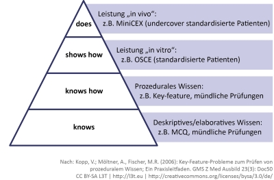

Gemeinhin existieren verschiedene Formen von Prüfungen, die Unterschiede in Bezug auf ihre didaktische Ausrichtung und Zielstellung aufweisen. Auf ihre Art stellen sie jeweils eine Strategie dar, zu evaluieren, inwiefern die Ziele eines Lehr-Lernprozesses erreicht wurden und übernehmen dabei unterschiedliche Aufgaben: **Förderung und Selektion** (Tabelle 1).

Summatives Assessment 
(Assessment of Learning) Formatives Assessment 
(Assessment for Learning) Diagnostisches Assessment Self-Assessment Eignungstest Selektiver Charakter Fördernder Charakter Fördernder Charakter Selektiver Charakter Formale Qualifikation über das Erreichen eines Kompetenzniveaus Praktische Anwendung von Erlerntem; Evaluation von Lernfortschritten Eigendiagnostische Lernevaluation Initiale Diagnose von Kompetenzniveaus Prüfung am Ende eines Lehr-Lernprozesses Aufgaben während des Lehr-Lernprozesses Prüfungen fortwährend (insb. zu Beginn) möglich Prüfung zu Beginn eines Lehr-Lernprozesses Teilnahme verpflichtend Teilnahme i. d. R. freiwillig Teilnahme i. d. R. freiwillig Teilnahme i. d. R. verpflichtend Bewertung und Benotung durch Lehrende Korrektur und Bewertung durch Lehrende, i. d. R. keine Benotung i. d. R. keine Benotung und Korrektur Bewertung durch Lehrende

</blockquote>

Tab. 1: Formen von Lernfortschrittskontrollen (Mischformen zwischen den genannten Kriterien können in der Praxis auftreten und auch sinnvoll sein)

Für Lernfortschrittskontrollen (LFK) mit selektivem Charakter hat sich die Bezeichnung **summatives Assessment** etabliert, da es sich oft um Prüfungen handelt, die eine Lernphase abschließen und das Erreichen des Lernziels überprüfen (siehe Abbildung 2). Summative Assessments fokussieren somit auf den Output des Lernens und belegen das Erreichen eines bestimmten Kompetenzniveaus (Reinmann, 2007; Winther, 2006). Dabei kann die Abfrage von Wissen, Fertigkeiten und Einstellungen passend im Rahmen des „Constructive Alignment“ (Biggs und Tang, 2011) mündlich, praktisch oder schriftlich erfolgen. Neben der reinen Entscheidung über das Bestehen der Prüfung wird hierbei oft noch eine (graduelle) Benotung erforderlich.

**Lernfortschrittskontrollen** mit förderndem Charakter werden als **formatives Assessment** bezeichnet. Die Lernfortschrittskontrollen sind in Form mehrerer kleiner oder kontinuierlicher Überprüfungen in den Lernprozess integriert und können die Konstruktion und Festigung von vermitteltem Wissen und Fähigkeiten unterstützen. Das regelmäßige, selbständige und oftmals freiwillige Bearbeiten von Arbeitsaufträgen und das damit einhergehende Feedback können den Lernenden helfen, eigene Fehler zu erkennen und in Zusammenhang mit seinem Lernverhalten zu bringen. Gerade bei E-Learning-Modulen stellen sie eine sehr häufige und wichtige Interaktionsform dar. Sie können ferner den Lehrenden dazu dienen, Lehr- und Lernprozesse zu überwachen und instruktionale Maßnahmen zur besseren Kompetenzentwicklung einzuleiten (Winther, 2006).

Beim formativen Assessment gibt es demzufolge mehrere Gelegenheiten zur Evaluation unter realistischeren Bedingungen, wodurch ein kontinuierlicher Überblick über Lernfortschritte gewonnen werden kann. Ein sehr typisches Beispiel hierfür sind die Progresstests, die einerseits den Lernenden regelmäßig individuelles Feedback über ihren Lernstand und -fortschritt und andererseits den Lehrenden Feedback über den Leistungsstand der gesamten Lerngruppe geben (Osterberg et al., 2006).

<figure>
  
  <figcaption>Abb. 2: Millers Kompetenzpyramide mit passenden Prüfungsformen (modifiziert nach Kopp 2006)</figcaption>
</figure>

Neben summativen und formativen Assessments findet das **diagnostische Assessment** zunehmend Verbreitung. Unter diesem Begriff werden zwei unterschiedliche Formen zusammengefasst. Die erste Form des diagnostischen Assessments zielt durch lernbegleitende, freiwillige Lernfortschrittskontrollen auf eine Förderung der Lernenden ab. Dieser Form des diagnostischen Assessments sind zum Beispiel die so genannten Self-Assessments zuzuordnen, die zur fundierten Studienfachwahl beitragen sollen (Zimmerhofer et al., 2006). Die Teilnahme an Self-Assessments erfolgt in der Regel freiwillig und ist im Allgemeinen nicht an eine Bewertung oder Begutachtung durch eine Lehrperson geknüpft.

Die zweite Form besitzt einen eignungsdiagnostischen und damit gegebenenfalls einen selektiven Charakter. In diese Kategorie des diagnostischen Assessments fallen eignungsdiagnostische Tests, wie zum Beispiel das Auswahlverfahren der Hochschule (Schaper &amp; Ehlers, 2011). Durch das Durchführen von initialen, also dem Lehr-Lernprozess vorangestellten Prüfungen wird beabsichtigt, ausgewogene Lerngruppen zu formen oder die Lehr-Lernprozesse an die Kenntnisse und Fähigkeiten der Lernenden anzupassen (Chalmers &amp; McAusland, 2002).

Es existieren viele verschiedene Ansätze und Systeme zur **Computerunterstützung von Lernfortschrittskontrollen**. Im Regelfall basieren sie auf den traditionellen Formen des Assessments und sind ihnen in Bezug auf Didaktik, Methodik und Organisation sehr ähnlich. Studien zufolge ist es auch sinnvoll, neue elektronische Lehr- und Lernformen zunächst äquivalent zu gängigen traditionellen Methoden zu gestalten (Dyckhoff et al., 2008; Kleimann &amp; Wannemacher, 2005). Jedoch wird vermehrt der Einsatz innovativer Konzepte und die Implikation einer neuen Lernkultur gefordert (Meder, 2006).

Mit dem Aufkommen von E-Assessment geht eine Diskussion einher, ob die neuen Medien als technologische Impulsgeber die **Etablierung alternativer Prüfungsarten** bewirken können (Bisovsky &amp; Schaffert, 2009; Reinmann, 2007). Web-Didaktiker/innen entwickeln daher ständig neue Formen für die medial unterstützte Leistungserbringung und -beurteilung. Exemplarisch kann hier die Anfertigung von Facharbeiten in Form von online recherchierten Kollagen weltweit verfügbaren Wissens genannt werden oder online bereitgestellte Arbeitsmappen, die Dateien mit produkt- oder aufgabenorientierten Leistungen der Lernenden auf einer E-Learning- Plattform zusammenfassen (Meder, 2006). Ein innovativer und neuer Ansatz zur Überprüfung von Wissen und Fähigkeiten ist das automatische und kontinuierliche Assessment und Feedback von Aktivitäten und Interaktionen in simulierten Umgebungen von virtuellen Welten. Damit können Fähigkeiten trainiert und überprüft werden, wie zum Beispiel das richtige Verhalten bei Feueralarm, oder das Verständnis von physikalischen Gesetzmäßigkeiten, wie zum Beispiel die dynamischen Grundgesetze eines Pendels (Mader et al., 2013).

### In der Praxis: Assessments in der Hochschule

</blockquote>

In der universitären Prüfungspraxis kann man von einer Art „universitärem Dreikampf“ sprechen: Klausuren, Referate, Hausarbeiten (Reinmann, 2007). Hinzu kommen Prüfungsarten mit dem Ziel der Förderung von Studierenden wie obligatorische oder freiwillige Übungen und Praktika. Auch wenn noch lange nicht von einem flächendeckenden Einsatz von E-Assessment-Systemen in der Hochschule gesprochen werden kann, so ist zu bemerken, dass einige Formen von Lernfortschrittskontrollen überhaupt erst dank Computerunterstützung realisierbar sind und in den letzten Jahren die Bestrebungen zunehmen, E-Assessments an den meisten Hochschulen zu etablieren. Die Kontrolle formativer oder diagnostischer Assessments zur Lernförderung kann aufgrund beschränkter personeller Ressourcen in den Hochschulen oft nicht im wünschenswerten Umfang angeboten werden. Die Studierenden erhalten damit in vielen Fällen erst in der Abschlussprüfung ein Feedback zu ihrem persönlichen Lernstand. (Teil-)automatische Korrekturen entlasten den Lehrenden und eröffnen so die Möglichkeit, regelmäßige Lernfortschrittskontrollen wie zum Beispiel wöchentliche Übungsaufgaben anzubieten oder direkt im Unterricht zum Beispiel über Audience-Response-Systeme durchzuführen (Ehlers et al., 2010). Neben diesen organisatorischen Vorteilen eröffnet auch die Einbindung verschiedenartiger digitaler Medien wie Sound- und Filmdateien oder Simulationen Möglichkeiten für universitäre Prüfungen, die bei traditionellen Papierverfahren nicht realisierbar wären. Auch bei praktischen oder mündlichen Prüfungen erlaubt der Einsatz von Computern und Fragendatenbanken neben einer schnelleren Auswertung auch eine Standardisierung und Strukturierung der Einzelprüfungen.

Sowohl die Freie Universität Berlin als auch die Universität Bremen sind im deutschsprachigem Raum Vorreiter im Bereich elektronischer Klausuren in eigenen Prüfungscentern, während die Stiftung Tierärztliche Hochschule Hannover und die Medizinische Hochschule Hannover durch den Einkauf der Dienstleistung „E-Prüfung“ und Einsatz in bestehenden Hörsälen bereits über 200.000 Einzelprüfungen durchführen konnten.

Das so genannte E-Portfolio, das derzeit viel diskutiert wird, bezeichnet zum Beispiel netzbasierte Sammelmappen, die verschiedene digitale Medien und Services integrieren (Bisovsky &amp; Schaffert, 2009). Lernende können ein E-Portfolio als digitalen Speicher der Artefakte kreieren und pflegen, die sie im Verlauf eines Kurses oder auch während des gesamten Lernprozesses erarbeiten. So kann die Kompetenzentwicklung in einer bestimmten Zeitspanne und für bestimmte Zwecke dokumentiert und veranschaulicht werden (Bisovsky &amp; Schaffert, 2009).

Computerunterstützung in Prüfungsprozessen ermöglicht Lehrenden bzw. Prüfenden folglich eine Fülle neuer Varianten zur Ermittlung von Lernfortschritten. Doch unabhängig von Ausprägung und Ausgestaltung des Computereinsatzes ist festzuhalten, dass sich die elektronische Kontrolle und Beurteilung von Lernfortschritten langfristig nur dann als wirklich effektiv erweist, wenn sie für die speziellen Einsatzzwecke in den jeweiligen Veranstaltungen optimal konfiguriert ist und sich gut in die bestehende Bildungspraxis einpassen lässt (Eilers et al., 2008). Lehrende und Lernende müssen sich an die neuen Bedingungen gewöhnen, die Methoden und Konzepte müssen in angemessener Form auf elektronische Medien abgebildet werden und die notwendigen studienorganisatorischen, infrastrukturellen oder prüfungsrechtlichen Rahmenbedingungen müssen geschaffen werden.

<blockquote style="background: #B3E5FC; border-left: 10px solid #039BE5">

### !

Denken Sie an eine oder mehrere typische offene Prüfungsaufgaben in Ihrem Lehr-Lerngebiet. Überlegen Sie sich, wie diese Prüfungsaufgaben im Aufgabenformat Multiple-Choice abgebildet werden könnten. Überlegen Sie sich dafür jeweils einen geeigneten Aufgabentext (auch Stamm genannt) sowie eine angemessene Anzahl sinnvoller Antwortalternativen. Achten Sie dabei darauf, dass die Distraktoren, also die falschen Antworten, nicht zu offensichtlich sind und die richtigen Antworten nicht zu leicht zu erraten sind. Beachten Sie dabei auch, welche Wissensstufe (Taxonomie nach BLOOM) durch die Frage getestet wird. Durch das Einbringen von Fallbeschreibungen, Statistiken oder Bildern können Sie zum Beispiel auch Verständnis statt reinem Faktenwissen überprüfen.

Man unterscheidet im Allgemeinen summative, formative und diagnostische Assessments. Überlegen Sie sich zu jeder Form ein konkretes Prüfungsszenario, in dem Sie eine computerunterstützte Lernfortschrittskontrolle für sinnvoll erachten würden.

</blockquote>

<figure>
  
  <figcaption>Abb. 3: Einfache Wissensabfrage mit Multiple-Choice</figcaption>
</figure>

