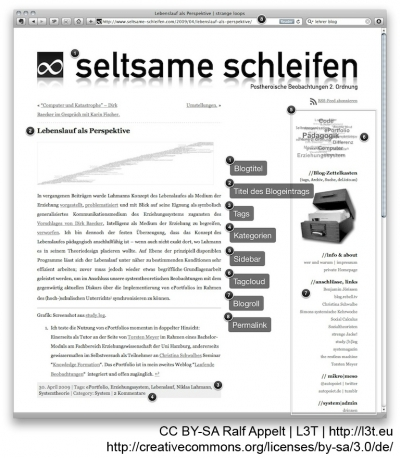
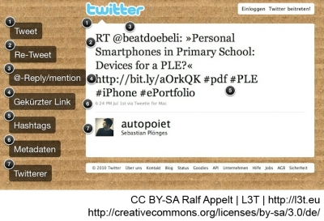

Im praktischen Umgang mit Micro-/Blogs wird eine Reihe von spezifischen sprachlichen Ausdrücken und im Fall von Microblogging auch eine spezifische Syntax verwendet. Die gängigen Begrifflichkeiten werden im Folgenden dargestellt.

<blockquote style="background: #B3E5FC; border-left: 10px solid #039BE5">

### !

Bei der Arbeit mit Micro-/Blogs ist ein Verständnis von Jargon und Funktionen hilfreich (u.a. Blogpost, Tagcloud, Permalink).

</blockquote>

## Jargon und Funktionen von Blogs

Das Schreiben im Blog (Bloggen) wird von Autorinnen oder Autoren (Bloggerinnen oder Bloggern) der Blogeinträge (Blogposts) vorgenommen. Dabei hat jeder Blogpost eine eigene, permanente Internetadresse (Permalink). Blogposts werden auch durch Schlagworte (Tags) kategorisiert. Inhaltsverwandte Blogposts werden mit gleichen Tags versehen und können damit leicht gefunden werden. Alle in einem Blog verwendeten Tags können als eine sogenannte ‚Wortwolke‘ (Tagcloud) dargestellt werden (siehe Abbildung 1).

Walker (2003) definiert einen Blog als eine regelmäßig auf den neuesten Stand gebrachte Website, deren Einträge in chronologisch umgekehrter Reihenfolge gereiht werden, so dass der aktuelle Eintrag der erste ist. Weblogs haben folgende Eigenschaften:

- Weblogs werden in regelmäßigen Abständen mit Beiträgen versehen. Es sind also keine statischen Webseiten, sondern sie sind ,lebendig‘. Mittels RSS-Technologie (siehe Kapitel #webtech) sind Weblogs beobachtbar, das heißt Leser/innen werden automatisch über neue Beiträge informiert.
- Blogger/innen können ihre Einträge ohne große Programmierkenntnisse verfassen. Waren vor Jahren zumindest HTML-Kenntnisse erforderlich, um Webseiten zu erstellen, fällt dies bei Weblogs völlig weg. Editoren gehören zu den Standardwerkzeugen einer Weblog-Software.
- Es besteht die Möglichkeit des Sammelns und Teilens: Neue Beiträge stehen immer an oberster Stelle, sind durch Tags (Schlagwörter) wiederauffindbar und können einfach von anderen Bloggerinnen und Bloggern referenziert werden.
- Die Beiträge sind von Einzelnen geschrieben und persönliche, subjektive Beiträge. Weblogs sind personenzentriert, geben Meinungen wieder und sind subjektiv: Eines der wesentlichsten Charakteristika des Web 2.0.

<figure>
  
  <figcaption>Abb. 1: Jargon und Funktionen von Blogs.</figcaption>
</figure>

<blockquote style="background: #B3E5FC; border-left: 10px solid #039BE5">

### !

Blogs können bei solchen Diensten wie Wordpress oder Blogger kostenlos angelegt werden. Wordpress bietet auch ein System zur Selbstinstallation an.

</blockquote>

Erstes, nachstehendes, Element wird ans Ende der vorherigen Seite gestellt

### In der Praxis: Praxisbeispiele Weblogs

Im Sinne des lebenslangen Lernens werden im Folgenden ausgewählte Praxisbeispiele für den Einsatz von Blogs und Microblogs in einzelnen Bildungsstufen (Kindergarten, Schule, Aus-/Weiterbildung, Hochschule) und in informellen Lernkontexten (außerhalb von formellen Bildungsinstitutionen) vorgestellt. </blockquote>

- Kindergartenblogs: In Kindergartenblogs schreiben Erzieher/innen über Erlebnisse der Kinder, Veranstaltungen, Gedichte und Themen rund um Erziehung. Beispiel: [http://blog.kindergarten-montessori.de/](http://blog.kindergarten-montessori.de/)
- Lehrerblogs: In Lehrerblogs erzählen Lehrer/innen über den Schulalltag, Unterrichtsmaterialien, Lehrmethoden und verschiedene schul- und bildungsrelevante Themen. Beispiel: [http://www.herr-rau.de/wordpress/](http://www.herr-rau.de/wordpress/)
- Azubiblogs: In Azubiblogs schreiben Auszubildende zu Themen rund um die Ausbildung. Azubiblogs geben vorhandenen und potentiellen Auszubildenden einen Einblick in das jeweilige Unternehmen und in die Ausbildungsberufe. Beispiel: [http://ottoazubiblog.de/](http://ottoazubiblog.de/)
- Blogs in Lernportalen: Einige Lernportale bieten Blogdienste für Auszubildende an. Diese befinden sich häufig in einem geschlossenen Bereich für registrierte Nutzer/innen. Beispiel: [http://www.mediencommunity.de/](http://www.mediencommunity.de/)
- Weiterbildungsblogs: In Weiterbildungsblogs erscheinen Beiträge mit einem Fokus auf die digitale Weiterbildung. Beispiel: [http://www.weiterbildungsblog.de/](http://www.weiterbildungsblog.de/)
- Vorlesungsblogs: In Vorlesungsblogs werden Beiträge zu Vorlesungen veröffentlicht. Vorlesungen werden auch als Audio- und Videopodcasts bereitgestellt. Beispiel: [http://mms.uni-hamburg.de/blogs/medien-bildung/](http://mms.uni-hamburg.de/blogs/medien-bildung/)
- Dozentenblogs: Dozentenblogs berichten über Projekte, stellen Begleitmaterialien sowie Informationen zu Veröffentlichungen und Lehrveranstaltungen bereit. Beispiel: [http://medialogy.de/](http://medialogy.de/)

## Jargon und Funktionen von Microblogs

Neben Tumblr, Edmodo, Yammer oder Status.net steht vor allem Twitter schon fast als Synonym für das Microblogging. Dies ist auch der Grund, warum nachfolgend der spezifische Jargon und die Syntax von Twitter-Nachrichten näher beschrieben werden. Dabei werden viele der Begrifflichkeiten von den englischen Worten ,‚twitter‘ (zwitschern) und ,‚tweet‘‘ (Pieps) abgeleitet.

Wer eine Twitter-Nachricht (‚Tweet‘) senden (,twittern‘) möchte, kann nur 140 Zeichen pro Tweet verwenden. Mit einer Kombination aus Doppelkreuz-Zeichen (#, engl. ,‚hash‘) und einem Schlagwort (engl. ,‚tag‘), also einem Hashtag, erhalten Tweets eine Art Metainformation. Anhand von Hashtags, die in Tweets enthalten sind, können Tweets zu bestimmten Themen gesucht werden. Durch die Kombination eines @-Zeichens und eines Twitter-Benutzer/innen-Namens (@Benutzer/innen-Name) können andere Twitter-Nutzende (,Twitterer‘) öffentlich angesprochen werden. Zwei Twitterer, die sich gegenseitig als Kontakt hinzugefügt haben (‚Follower‘),, können sich auch private, direkte Nachrichten (‚directmessage‘,‘dm‘) senden. Dazu wird die folgende Zeichenkombination verwendet: ,‚d Benutzername‘. Öffentliche Tweets können in der ursprünglichen Form an eigene Follower weitergeleitet (RT entspricht ‚re-tweeted‘) werden (siehe Abbildung 2).

<figure>
  
  <figcaption>Abb. 2: Jargon und Funktionen des Microbloggingsystems Twitter.</figcaption>
</figure>

### In der Praxis: Praxisbeispiele Microblogs

Im folgenden Abschnitt werden ausgewählte Praxisbeispiele für den Einsatz von Microblogs vorgestellt. </blockquote>

- Twitter wird für Deutsch als Fremdsprache (DaF) im Unterricht und zur Vernetzung von DaF-Lehrenden genutzt. Dabei wird Twitter sowohl von einzelnen DaF-Lehrenden als auch von DaF-Institutionen eingesetzt. Im Fremdsprachenunterricht können Microblogs zur Wortschatzerweiterung und für Grammatikübungen eingesetzt werden. URL: [http://wiki.zum.de/Twitter\_in\_DaF](http://wiki.zum.de/Twitter_in_DaF)
- Der Blog Azubister nutzt Twitter, um aktuelle Informationen zur Ausbildung, neuen Lehrstellen, Tipps zur Berufswahl und zum Ausbildungsmarketing im Web 2.0 an Interessierte zu kommunizieren. URL: [http://twitter.com/azubister](http://twitter.com/azubister)
- An der Hochschule Darmstadt wurde Twitter im Laufe des Semesters im Rahmen eines PR-Seminars explorativ genutzt. Studierende haben Twitter als Online-Kommunikationsmedium verwendet. Das Ziel war auch, das Lernen außerhalb der Hochschule fortzusetzen. URL: [http://thomaspleil.wordpress.com/2009/03/03/twitter-in-der-lehre-ein-paar-erfahrungen/](http://thomaspleil.wordpress.com/2009/03/03/twitter-in-der-lehre-ein-paar-erfahrungen/)
