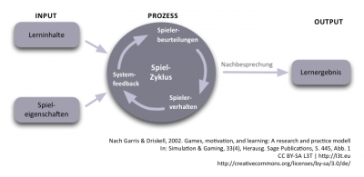

<!-- filename: 02_Grundueberlegungen.md -->
<!-- title: Grundüberlegungen -->

Digitale Spiele sind nach Wagner (2008) ein regelbasiertes, interaktives Medium, das Spielende „emotional bindet und innerhalb eines von der objektiven Realität abgegrenzten Raums stattfindet“ (S. 49) und dessen „zugrunde liegende Interaktionstechnologie rein digitaler Natur ist“ (S. 50). Zwar handelt es sich bei Spielen aus informationstechnischer Sicht um Software, sie unterscheiden sich aber von anderen Softwareformen dadurch, dass es keinen zweckbezogenen Bedarf für sie gibt (Sellers, 2006). Sie werden nicht erstellt, um festgelegte Nutzerziele oder erforderliche Aufgaben zu erfüllen beziehungsweise zu unterstützen; die Nutzer/innen sind also nicht auf sie angewiesen. Da digitale Spiele im Wesentlichen der Unterhaltung dienen, stehen die Hersteller im Gegensatz zu anderen Softwareproduzierenden vor der Herausforderung, Bedarf für ihre Produkte überhaupt erst zu wecken. Die hohen, internationalen Wachstumsraten der Spielbranche in den letzten Jahren zeigten, dass dies auch gut gelingt. Der sich verschärfende Wettbewerb um die Aufmerksamkeit der Kunden führt aber gleichzeitig dazu, dass die Spielproduktion immer aufwändiger und teurer wird. Zum Beispiel lagen laut Holowaty (2010) die Produktionskosten für die zehn teuersten Spiele in den Jahre 2009 und 2010 im zweistelligen Millionenbereich.

<blockquote style="background: #B3E5FC; border-left: 10px solid #039BE5">

### !

Digitale Spiele (Bildschirmspiele oder Computer- und Videospiele) sind ein regelbasiertes, interaktives Medium, das Spielende emotional bindet und innerhalb eines virtuellen Raums stattfindet, dessen zugrunde liegende Interaktionstechnologie rein digitaler Natur ist. Beispiele für Interaktionstechnologien sind Arcade-Automaten, mobile oder stationäre Computer und Videokonsolen sowie Mobiltelefone.

</blockquote>

Es existieren verschiedene **Typen digitaler Spiele**, leider findet sich in der Literatur jedoch bisher keine einheitliche Klassifizierung. Je nachdem, welche Merkmale ein Verfasser oder eine Verfasserin für seine Einordnung berücksichtigt, ergeben sich entsprechend unterschiedlich viele Spielgenres (Gauguin, 2010). Typische Unterscheidungsmerkmale sind dabei die Spieldynamik, die Symbolstruktur oder die Handlungsanforderung, was auf die folgenden grundlegenden Spielgenres schließen lässt (wobei anzumerken ist, dass aktuelle Unterhaltungsspiele in der Regel Merkmale mehrerer Genres aufweisen) (Feil &amp; Scattergood, 2005; Pedersen, 2003):

- Actionspiele, in denen die Reaktionsgeschwindigkeit entscheidend ist;
- Adventurespiele, in denen das Lösen von Rätselaufgaben die Rahmengeschichte fortführt;
- Casual Games, deren Spielrahmung weniger komplex und deren Spielregeln schnell erlernbar sind, so dass sich die Spiele gut für eine „gelegentliche“ und beiläufige Nutzung eignen;
- Rollenspiele, in denen sich die Spielfiguren durch Aktionen in ihren Attributen weiterentwickeln und somit das Identifikationsempfinden steigern;
- Simulationsspiele, die Spielende realitätsnahe Erfahrungen nachempfinden lassen, dabei aber weniger realistisch sind als simulierende Trainingsapplikationen;
- Sportspiele mit unterschiedlichen Realitätsgraden, die in ihren Regeln echten Sportarten nachempfunden sind;
- Strategiespiele, in denen ein kluges Management von Ressourcen und Einheiten zum Spielerfolg führt.

Die Popularität und der Spielspaß von digitalen Spielen können dadurch erklärt werden, dass verschiedene Mechanismen des Unterhaltungserlebens sequenziell oder parallel ausgenutzt und aktiviert werden. **Zentrale Unterhaltungsprozesse** sind nach Klimmt (2008) Selbstwirksamkeitserfahrung, Spannung bzw. Lösung und simulierte Lebens- und Rollenerfahrungen, die bei Spielen zu einem integrierten Erlebnis verschmelzen:

- Eine **Selbstwirksamkeitserfahrung** macht ein Spieler oder eine Spielerin, wenn auf seine Aktivität eine unmittelbare Reaktion des Spiels erfolgt. Er erhält hier das Gefühl, einen unmittelbaren Einfluss auf das Geschehen in der Spielumgebung zu nehmen.
- **Spannung** entsteht in digitalen Spielen durch die Handlungsnotwendigkeiten, mit denen die Spielenden immer wieder konfrontiert werden, sowie durch die emotionale Anteilnahme an der Medienfigur, die von Spielenden selbst verkörpert wird. Positive Ergebnisse der Spannungsauflösung führen daher zu starken emotionalen Erleichterungen, die sich in Form von Stolz und gesteigerten Selbstwertgefühlen äußern können. Negative Ergebnisse hingegen können zu negativen Emotionen wie Frust und Enttäuschungen führen.
- **Lebens- und Rollenerfahrungen** machen Spielende durch das Eintauchen in die Rahmengeschichte der Spiele. Diese Erfahrungen sind möglich, weil in den Spielen häufig Realitäten auf multimediale Weise simuliert werden. Die Mechanismen des Unterhaltungserlebens funktionieren allerdings nur dann über einen längeren Zeitraum, wenn Spielende kontinuierlich Erfolge erzielen. Erfolg in Spielen zu haben bedeutet, das Spiel kontrollieren zu können beziehungsweise seinen Leistungsanforderungen gerecht zu werden. Für Fritz (2005) ist diese Form der Machtausübung in der virtuellen Welt der Hauptgrund dafür, dass gerade Heranwachsende mit ihren altersspezifischen Schwierigkeiten – wie etwa dem Gefühl eines Kontrollverlustes in ihrer sozialen Umwelt – von digitalen Spielen fasziniert sind.

Eng verbunden mit der Selbstwirksamkeit und der erfolgreichen Kontrolle eines Spiels ist die Lernfähigkeit eines Spielers oder einer Spielerin. Das Erlernen von Spielen beschreiben Garris &amp; Driskell (2002) dabei als einen Spielzyklus aus Spielerverhalten, Rückmeldungen des Programms und der daraufhin von Spielenden vorgenommenen Beurteilung des Spielfeedbacks und des eigenen vorherigen Verhaltens (vgl. ebenso die Ausführungen von Kerres et al., 2009). Die Spieler reagieren dabei mit einem unterschiedlich hohen Grad an Interesse, Freude, Ehrgeiz oder Selbstvertrauen auf das Feedback, was wiederum die Richtung, Intensität und Qualität ihres weiteren Verhaltens beeinflusst. Spielende führen also einen Spielzug aus, erhalten eine Reaktion, bewerten anschließend ihre Situation und können sich dann zu einem weiteren Spielzug entscheiden. Wird ihr Handeln als richtig akzeptiert, fühlen sie sich positiv bestätigt und ihr Interesse am Weiterspielen steigt. Wird ihr Zug aber als falsch deklariert, fühlen sie sich herausgefordert. Ihr Ehrgeiz steigt und sie nehmen solange alternative Handlungen vor, bis bei wiederholtem Misserfolg ihre individuelle Frustgrenze erreicht ist und sie das Spiel entnervt beenden. In der Regel durchlaufen Spielende diesen Zyklus nach dem Versuch-und-Irrtum-Prinzip mehrfach und erwerben damit schließlich die erforderliche Kompetenz.

Eine kritische Komponente des Zyklus stellen folglich die Rückmeldungen des Programms und somit die im Spiel implementierten Hilfefunktionen und Regeln dar. Spiele mit gutem Spieldesign zeichnen sich durch eine abgestimmte Balance von Herausforderungen und Erfolgserlebnissen aus. Abbildung 1 zeigt den Spielzyklus.

Ein Verständnis für die Spielidee zu entwickeln bedeutet, dass Spielende deklaratives Wissen über die Objekte und Regeln des Spiels erwerben, welches sie im Spielzyklus anwenden und weiterentwickeln. Bei komplexeren Spielen würde der Aufbau einer deklarativen Wissensbasis jedoch zu einer regelrechten Einstiegshürde heranwachsen, weshalb hier typischerweise einer prozeduralen Wissensgenerierung im Spielverlauf (Learning-by-Doing) der Vorzug gewährt wird. Die zunächst verborgene Logik des Spiels wird von Spielenden erst nach und nach erkundet, was sie jedoch nicht vom erfolgreichen Spielen abhält. Kerres et al. (2009) weisen in diesem Kontext darauf hin, dass in digitalen Spielen vorwiegend implizites Lernen stattfindet. Das trainierte Verhaltensrepertoire Spielender wird durch den Spielzyklus hochgradig routiniert und läuft weitgehend automatisch ab. Explizites Lernen wird aber immer dann notwendig, wenn die Spielenden nicht mehr weiterkommen und sich gezwungen sehen, aus der Spielwelt in die Realität aufzutauchen, um nach geeigneten Problemlösungen zu suchen. Spiele, die Spielenden zu häufigen und langen Phasen expliziten Lernens zwingen, laufen dabei Gefahr, schnell an Attraktivität zu verlieren.

<figure>
  
  <figcaption>Abb. 1: Input-Prozess-Output-Spielmodell (nach Garris &amp; Driskell, 2002)</figcaption>
</figure>

