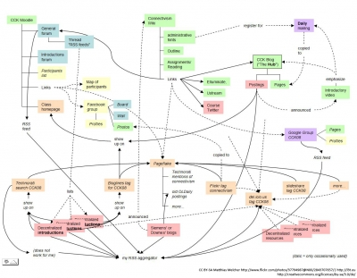

In jüngster Zeit sind ‚Massive Open Online Courses’, abgekürzt MOOCs, in das Zentrum vieler bildungspolitischer und mediendidaktischer Diskussionen gerückt. Je nach Perspektive und Standort des Betrachters beziehungsweise der Betrachterin ist die Rede von der ‚Globalisierung der Lehre‘, der ‚Demokratisierung der Bildung‘, der ‚Krise der Hochschulen‘ oder einfach ‚neuen Welten des Online-Lernens‘. Wesentliche Charakteristika von MOOCs drückt bereits der Begriff aus:

- **Massive:** Die Zahl der Teilnehmenden an einem MOOC ist unbegrenzt. Sie kann von einigen Hundert bis zu mehreren Zehntausend reichen.

- **Open:** Die Teilnahme an einem MOOC ist kostenlos und, bis auf einen Online-Zugang, an keine Voraussetzungen für die Lernenden geknüpft.

- **Online:** Der Kurs findet ausschließlich im Internet statt.

- **Course:** MOOCs sind in der Regel mehrwöchige Kurse, die mit einem festen Start- und Endtermin verbunden sind. Das schließt nicht aus, dass die Kursinhalte auch über das Kursende hinaus frei zugänglich sind.

## **Entwicklungslinien und MOOC-Formate**

Der Online-Kurs, in dessen Umfeld der Begriff „MOOC“ geprägt wurde, hatte den Titel „Connectivism and Connective Knowledge“ und wurde im Herbst 2008 von George Siemens und Stephen Downes angeboten. Dieser Kurs, der unter dem Kürzel „CCK08“ bekannt wurde, dauerte zwölf Wochen (siehe: [http://wwwapps.cc.umanitoba.ca/moodle/course/view.php?id=20](http://wwwapps.cc.umanitoba.ca/moodle/course/view.php?id=20)). Grundlage bildete eine Agenda mit wöchentlich wechselnden Themen, regelmäßigen Live-Events mit Gastreferentinnen und Gastreferenten, Lektüreempfehlungen sowie konkreten Aufgaben und Aktivitäten, die den Lernenden Anlässe boten, sich mit dem jeweiligen Thema der Woche auseinanderzusetzen. Die Gastgeber verzichteten jedoch auf die Vorgabe von Lernzielen, auf die eigene Entwicklung von Lerninhalten, auf Tests und Prüfungen sowie eigene Formen der Zertifizierung. Im Mittelpunkt sollten Lernende stehen, die sich selbstorganisiert mit dem Thema des MOOCs auseinandersetzen, eigene Ziele formulieren, eigene Diskussionsbeiträge entwickeln, sich mit anderen Lernenden vernetzen und dafür die Plattformen und Instrumente des Internets nutzen, die ihnen vertraut sind (Robes, 2012).

Der CCK08 wurde zum ersten Modell für das neue MOOC-Format. Da sich George Siemens und Stephen Downes bei der Entwicklung und Umsetzung ihrer Kurse an der Idee des Konnektivismus (Siemens, 2004) orientierten, werden MOOCs, die diesem Modell folgen, als ‚cMOOCs’ bezeichnet (Wedekind, 2013, 48ff.).

Populär wurden MOOCs, als im Herbst 2011 im Umfeld von Stanford drei offene Online-Kurse angeboten wurden. Für einen dieser Kurse, „Introduction to Artificial Intelligence (AI)“, durchgeführt von Sebastian Thrun und Peter Norvig, meldeten sich allein 160.000 Teilnehmende an. Zum Vergleich: Der Kurs „CCK08” hatte 2200 Teilnehmende. Im Unterschied zu den dezentralen cMOOCs hatte der AI-Kurs eine zentrale Lernplattform und eine klare Struktur und Führung der Lernenden: Auf kurze Videobausteine, in denen die Lerninhalte präsentiert wurden, folgten regelmäßige Quizzes und Lernaufgaben sowie ein Abschlusstest. Für die Kommunikation der Teilnehmer/innen und Lehrenden standen Foren zur Verfügung.

Die hohe Zahl der Teilnehmer/innen und eine breite Berichterstattung führten dazu, dass sich unmittelbar nach Abschluss des AI-Kurses 2012 eine Reihe von MOOC-Anbietern formierten: ‚Udacity’ ([www.udacity.com](http://www.udacity.com), gegründet von Sebastian Thrun), „Coursera” ([www.coursera.org](http://www.coursera.org)) und „edX” ([www.edx.org](http://www.edx.org)). Hinter diesen Unternehmen stehen verschiedene Partnerschaften mit amerikanischen, aber auch europäischen Hochschulen oder Hochschullehrende. Auf der Grundlage des Kapitals von Stiftungen und Finanzinvestoren haben diese Anbieter in kurzer Zeit eine stetig wachsende Zahl von Kursen entwickelt und durchgeführt. Das Angebot von ‚Coursera’, der weltweit größten MOOC-Plattform, umfasst zum Beispiel 423 Kurse, die mit 83 Partnern entwickelt wurden und für die sich über 4,34 Millionen Teilnehmende angemeldet haben (Stand 12. August 2013). Im Mittelpunkt der im Anschluss an den AI-Kurs entwickelten MOOCs steht die strukturierte Vermittlung von Lerninhalten. In Anlehnung an einen der genannten MOOC-Anbieter, edX, hat sich für dieses MOOC-Format die Bezeichnung ‚xMOOCs’ durchgesetzt (Wedekind, 2013).

Mittlerweile gibt es auch im deutschsprachigen Raum eine Reihe von MOOC-Initiativen. Dazu gehören regelmäßig durchgeführte cMOOCs, aber auch erste xMOOC-Plattformen, die sich als Anlaufstelle für Hochschulen und ihre MOOC-Angebote etablieren wollen (Dillenbourg, 2013; Bremer, 2013).

<blockquote style="background: #B3E5FC; border-left: 10px solid #039BE5">

### !

Während cMOOCs vor allem auf die Vernetzung der Teilnehmenden und Informationen sowie das Entwickeln eigener Beiträge zum Kursthema setzen, führen xMOOCs die Lernenden durch strukturierte Lerninhalte, regelmäßige Wissensabfragen und Prüfungen.

</blockquote>

<figure>
  
  <figcaption>Abb. 2: Vernetzungen und vernetztes Lernen am Beispiel des CCK08. Quelle: Matthias Melcher ([http://www.flickr.com/photos/37794987@N00/2843707657/](http://www.flickr.com/photos/37794987@N00/2843707657/)) \[2013-08-24]</figcaption>
</figure>

## **MOOCs als partizipative Lernformate**

MOOCs sind entstanden, um die vielfältigen Möglichkeiten des Internets und der Social-Media-Instrumente und Plattformen für die gemeinsame Auseinandersetzung mit einem Thema zu nutzen. Deshalb wird vor allem im Rahmen von cMOOCs versucht, den Teilnehmenden nicht nur eine Kursstruktur und Lernmaterialien zur Verfügung zu stellen, sondern ihnen vielfältige Möglichkeiten der aktiven Teilnahme zu eröffnen.

Wie der gemeinsame Austausch im Rahmen eines MOOCs aussehen kann, soll kurz am Beispiel des ersten deutschsprachigen offenen Online-Kurses gezeigt werden, der sich mit der ‚Zukunft des Lernens’ beschäftigte und im Mai 2011 startete. Ein zentrales Element des Kurses war der Hashtag ‚#opco11’. Er ermöglichte es den fast 900 Teilnehmenden, ihre Beiträge auf Twitter und in anderen sozialen Netzwerken zu verfolgen und zu vernetzen. Und er erlaubte es den Gastgeberinnen und Gastgebern, die so gekennzeichneten Beiträge der Teilnehmenden, also zum Beispiel Blogposts und Tweets, auf dem Kursblog und als wöchentlichen Newsletter zusammenzufassen.

Wer sich aktiv am Kurs ‚Zukunft des Lernens’ beteiligte, tat dies vor allem über Twitter, eigene Blogbeiträge oder Kommentare. Darüber hinaus wurde die breite Palette an Social-Media-Tools genutzt, beispielsweise Etherpad, ein webbasierter Editor zur gemeinsamen Bearbeitung von Texten. Des Weiteren wurden Gruppen auf Facebook, Flickr, der Foto-Online-Plattform, und Diigo, einem Social-Bookmarking-Tool, gebildet. Einzelne Teilnehmende reflektierten ihre Eindrücke sogar in Form kurzer Audiobeiträge. Und mit Kursbeginn wurde täglich die ‚opco11-Zeitung’ publiziert, die automatisch aus Beiträgen verschiedener Social-Media-Plattformen wie zum Beispiel Twitter erstellt wurde und von allen Teilnehmenden abonniert werden konnte.

<blockquote style="background: #FFEBEE; border-left: 10px solid #F44336">

### ?

Wie verändert sich die Rolle des Lehrenden im Rahmen eines MOOCs? Welche Aufgaben entfallen im Vergleich zur Durchführung eines mehrwöchigen Präsenzkurses, welche verändern sich und welche kommen hinzu?

</blockquote>

## **MOOCs in der Diskussion**

Vor allem die schnelle Entwicklung und Verbreitung der xMOOCs hat zu einer breiten Diskussion und Kritik der Anbieter und ihrer Kursformate geführt. Dabei geht es um:

- die **bildungspolitischen Ansprüche:** Erste Auswertungen verschiedener Kursstatistiken zeigen, dass die Lernenden vor allem aus den großen westlichen Industrienationen kommen. MOOC-Teilnehmende sind zudem überdurchschnittlich qualifiziert und können häufig bereits akademische Abschlüsse vorweisen (University of Edinburgh, 2013). Eine ‚Demokratisierung’ und ‚Öffnung’ der Hochschulbildung hat sich noch nicht bestätigt.

- die **didaktische Umsetzung:** Die Didaktik der MOOCs wird als ‚objektivistisch’ und ‚behavioristisch’ beschrieben (Stacey, 2013). Erkenntnisse der Mediendidaktik bezüglich der Strukturierung des Lernstoffes, der Tiefe und Geschwindigkeit der Inhaltsvermittlung sowie der Gestaltung von Erfolgskontrollen für die Lernenden werden noch nicht ausreichend berücksichtigt (Schulmeister, 2012). Die hohe Zahl der Teilnehmenden sowie der Fokus auf die Entwicklung und Vermittlung der Inhalte führen dazu, dass kommunikative und interaktive Aspekte zu kurz kommen.

- die **Motivation der Teilnehmenden**: MOOCs weisen hohe Abbruchquoten auf. Je nach Kurs nehmen nur 2 bis 10 Prozent derjenigen, die sich für einen Kurs angemeldet haben, auch an der Abschlussprüfung teil. Erste Auswertungen lassen darauf schließen, dass die Motive von MOOC-Teilnehmenden sehr vielfältig sind: Sie reichen von der Neugier am Format, über das Interesse an einzelnen Bausteinen des Kurses bis zum Wunsch, das Abschlusszertifikat zu erreichen (Clark, 2013).

- die **Bedürfnisse und Kompetenzen der Teilnehmenden:** Vor allem cMOOCs setzen Lernende voraus, die das selbstorganisierte Lernen gewöhnt sind, die sich im Netz mitteilen können und wollen und die entsprechende Kompetenzen im Umgang mit Social-Media-Plattformen und -Instrumenten mitbringen. Das grenzt häufig die Zielgruppe ein, die mit MOOCs angesprochen werden kann.

- die **Öffnung der Lerninhalte:** MOOCs sind in der Regel ‚offen’, das heißt, die Teilnahme ist kostenlos und an keine Voraussetzungen gebunden. Es handelt sich aber häufig nicht um Open Educational Resources im engeren Sinne: Die Lerninhalte und -materialien sind nicht mit Lizenzen (zum Beispiel Creative Commons) ausgewiesen, die eine Weitergabe und Wiederverwendung erlauben (Clement, 2013).

- die **Geschäftsmodelle**: Die Entwicklung, Durchführung und Betreuung eines MOOCs ist mit erheblichem Aufwand verbunden. Das betrifft die Hochschulen beziehungsweise Hochschullehrenden, die die Kurse entwickeln. Das betrifft aber auch die Plattformanbieter, die die Kurse den Teilnehmenden zur Verfügung stellen. Derzeit existieren keine Geschäftsmodelle, die eine längerfristige Finanzierung der Plattformen und Kurse gewährleisten. Als mögliche Einnahmequellen werden unter anderem genannt: der Erwerb geprüfter Zertifikate, die Kooperation mit Unternehmen (Sponsoring, Zugriff auf Daten der Lernenden), Werbung, der Verkauf von Kursen oder Curricula an Hochschulen (Daniel, 2012).

Durch die wachsende Aufmerksamkeit und Verbreitung dieses Online-Formats wird darüber hinaus intensiv in weiteren Themenfeldern geforscht und experimentiert. Dabei geht es zum Beispiel um die Auswertung der Aktivitäten der Lernenden zur Verbesserung der Kursangebote (engl. ,learning analytics’), um die Verbesserung der Lernbausteine (Online-Videos), um die Anerkennung von Beiträgen der Lernenden im Kurskontext (Open Badges), um neue Formen des Feedbacks (Peer-to-Peer-Grading) und der Online-Prüfung (’Automated Assessments’).

<blockquote style="background: #FFEBEE; border-left: 10px solid #F44336">

### ?

Melden Sie sich auf einer MOOC-Plattform wie Iversity (www.iversity.org) oder Coursera (https://www.coursera.org) für einen Kurs an, und machen Sie sich ein Bild vom Aufbau und Ablauf des Kurses. Beobachten Sie vor allem, welche Möglichkeiten der aktiven Partizipation geboten und wie diese genutzt werden.

</blockquote>
