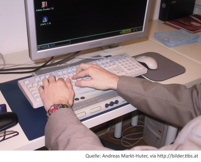

Informations- und Kommunikationstechnologien (IKT) zeichnen sich durch die Multimedialität der Darstellung und Multimodalität der Bedienungsschnittstellen aus: Bei einem digitalen Dokument werden erst in dem Moment, in dem auf ein Dokument zugegriffen wird, mit IKT und assistierenden Technologien die **medialen Qualitäten (Darstellung)** und die **Modalitäten der Steuerung (Handhabung)** des Dokuments realisiert. Durch diese Trennung entsteht die Möglichkeit auf ein und dasselbe Dokument auf unterschiedliche Art und Weise zuzugreifen, es auf unterschiedlichste Weise zu medialisieren und handzuhaben.

### In der Praxis : Benutzung einer Braillezeile

Auch Sehbeeinträchtigte und Blinde können Beiträge aus dem Internet lesen. Dazu wird der Text in einem Online-Forenbeitrag mittels einer Braillezeile, also einem Computerausgabegerät für Blinde, in Brailleschrift umgewandelt. Die auf der Braillezeile erzeugten Erhöhungen in Blindenschrift können dann mit den Fingerspitzen abgegriffen werden. Der gleiche Text könnte durch ein ‚Screenreader-Programm’ alternativ laut vorgelesen oder mittels Vergrößerungssoftware größer dargestellt werden. </blockquote>

<figure>
  
  <figcaption>Abb. 1: Benutzung einer Braillezeile</figcaption>
</figure>

Zu allen Bereichen, in denen Informations- und Kommunikationstechnologien zum Einsatz kommen, können Menschen mit Behinderung mittels Assistierenden Technologien (AT) selbständig(er)en und selbstgesteuert(er)en Zugang finden. Das gilt aber nur unter der Voraussetzung, dass die IKT-basierten Systeme Grundsätze und Standards des barrierefreien Zugangs befolgen (Miesenberger, 2004).

**Assistierende Technologien (AT)** bezeichnen Ausstattungen oder Software-Produkte, die verwendet werden, um die funktionalen Fähigkeiten von Menschen mit Behinderungen zu erhöhen, zu erhalten oder zu fördern. Darunter fallen Computertechnologien wie Screenreader, Spracheingaben, Vergrößerungssoftware oder Bildschirmtastatur. Sie helfen Menschen, selbstständig und unabhängig ihre Ziele in der Gesellschaft zu erreichen. Es existieren beinahe für jede Art einer Behinderung Ansatzpunkte, um über AT die Nutzung von IKT und über diese die Teilnahme an lebensweltlichen Prozessen zu ermöglichen.

Für den Zugang zu Informationen auf Webseiten und Lernumgebungen stehen sowohl für die Ein- als auch die Ausgabe zahlreiche Geräte zur Verfügung, die über Bildschirm, Tastatur, Maus und Drucker hinausgehen. Assistierende Technologien benutzen die Kodierung sowie den Inhalt einer Webseite und machen sie zugänglich.

In der weitreichenden Um- und Neugestaltung nahezu aller Bereiche der Lebenswelt durch Informations- und Kommunikationstechnologien liegen daher Anknüpfungspunkte für die Teilhabe behinderter Menschen an der Lebenswelt mittels Assistierender Technologien. Die Realisierung von Chancengleichheit (englisch ‚equality’) in der Gesellschaft für Menschen mit Behinderungen ist in immer größerem Maße von der Qualität der IKT, also von ‚e-Quality’, abhängig – daraus erwächst für die Gestaltung besonders im Bildungsbereich eine besondere Verantwortung (Miesenberger, 2008).

<blockquote style="background: #FFEBEE; border-left: 10px solid #F44336">

### ?

Verschaffen Sie sich auf [http://www.rehadat-hilfsmittel.de/de/kommunikation-information/computer\_und\_zubehoer\_software/index.html](http://www.rehadat-hilfsmittel.de/de/kommunikation-information/computer_und_zubehoer_software/index.html) und [http://www.barrierefrei-kommunizieren.de/datenbank/index\_produkte.php?art=wkin](http://www.barrierefrei-kommunizieren.de/datenbank/index_produkte.php?art=wkin) einen Überblick über die breite Palette von Assistierenden Technologien (AT).

</blockquote>

Bereits in der Gestaltung von webbasierten Lernumgebungen und -materialien müssen die Anpassung an und die Optimierung für die Nutzbarkeit für einzelne Nutzer/innen in ihrer jeweiligen Situation und den jeweiligen Voraussetzungen beziehungsweise den Schnittstellengeräten beachtet werden. Anstelle der Gestaltung einer starren, an ‚durchschnittlichen’ Nutzerinnen und Nutzern orientierten Benutzerschnittstelle (‚Interface’) treten Individualisierbarkeit und Adaptivität in den Vordergrund, welche letztendlich die Akzeptanz und die Nutzbarkeit der Systeme für alle unterstützen.

<blockquote style="background: #B3E5FC; border-left: 10px solid #039BE5">

### !

Barrierefreiheit bedeutet letztlich, dass Menschen unabhängig von Behinderung, Alter und technischer Infrastruktur auf Inhalte zugreifen können.

</blockquote>

Jede/r, die/der über eine Sinneswahrnehmung (zum Beispiel visuell, auditiv, taktil) verfügt, kann mit dieser die Informationsausgabe eines Computers wahrnehmen, beziehungsweise die Informationseingabe steuern – unabhängig von ihrer/seiner Behinderung (Miesenberger, 2005). Da dies aufgrund der unzähligen, auch individuell geprägten Barrieren nicht vollständig erreicht werden kann, spricht man auch von barrierearm oder zugänglich (englisch „accessible“).
