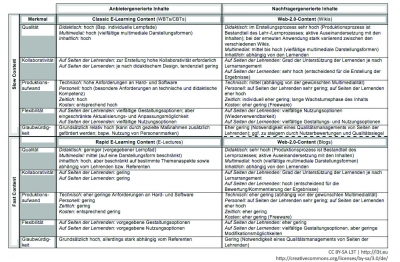

<!-- filename: 02_Systematisierungsansatz_fuer_technikgestuetzte_Lehr--Lernkomponenten.md -->
<!-- title: Systematisierungsansatz für technikgestützte Lehr-/Lernkomponenten -->

Bevor näher auf die Gestaltung von Lern-Services eingegangen wird, werden im Folgenden verschiedene Formen von technikgestützten Lehr-/Lernkomponenten definiert. Lern-Services stellen stets Leistungsbündel dar, die sich aus diesen Komponenten sowie ergänzenden Leistungsteilergebnissen und entsprechenden Prozessen zusammensetzen. Die dargestellte Klassifizierung und die darin enthaltenen Typen von Lehr-/Lernkomponenten bilden damit den modularen Baukasten für die Erstellung von Lern-Services. Sie bieten aber gleichzeitig auch eine Einschätzung über den mit den einzelnen Ausprägungen von Lernmaterialien verbundenen Erstellungsaufwand.

Es werden im Folgenden drei Typen technikgestützter Lehr-/Lernkomponenten – ‚Web- Based Trainings (WBTs)‘, ‚Rapid E-Learning‘ sowie ‚Learner-Generated Content‘ – unterschieden. Diese divergieren insbesondere in Bezug auf Erstellungszeit und -aufwand.

1. Als **Web-Based Trainings (WBTs)** (synonym: Lernmodul oder Selbstlerneinheit; Mair, 2005) bezeichnet man Lernprogramme, die auf Internet-Technologien basieren. Sie zeichnen sich durch aufeinander abgestimmte, multimediale Darstellung von Lerninhalten aus. Neben Texten, Grafiken, Tabellen, Videos, Ton können WBTs beispielsweise auch (interaktive) Animationen enthalten.
2. Der Begriff des **Rapid E-Learning** ist eine Wortzusammensetzung aus Rapid Prototyping und E-Learning und bezieht sich somit auf technikgestützte Lerninhalte mit einem beschleunigten Erstellungsprozess. Dazu gehören E-Lectures, das heißt digital aufbereitete Vorträge, die aus einer Kombination von Audio- bzw. Video-Elementen mit synchronisierten Text- und Bildelementen bestehen (Gersch, Lehr &amp; Fink, 2010; Reinmann &amp; Mandl, 2009). Auf diesem Wege wird (im Vergleich zu WBTs) eine zeit- und kostengünstige Erstellung von technikgestützten Lerninhalten ermöglicht, die zudem weniger technische Kompetenz auf Seiten der Erstellenden voraussetzt.
3. Ähnliches gilt auch für von **Lernenden erstellte Lerninhalte** (‚Learner-Generated Content‘). Das sind technikgestützte Lerninhalte, die im Rahmen von Lernarrangements durch die Lernenden selbst entwickelt, organisiert und technisch umgesetzt werden. Hierzu eignet sich insbesondere der Einsatz von Tools wie Wikis oder Blogs, die es den Lernenden ermöglichen, Inhalte kollaborativ mit den Mitlernenden zu entwickeln und somit eine sehr viel intensivere Auseinandersetzung mit den Lerninhalten fördern (Lehr, 2011). Die so erstellten Inhalte können zudem als Material für künftige Lernarrangements wiederverwendet werden (Wheeler et al., 2008).

Um einen nachhaltig erfolgversprechenden Rahmen für das technikgestützte Lehren und Lernen zu schaffen, muss die Wahl zwischen diesen drei Typen von Lehr-/Lernkomponenten auch unter Effizienzgesichtspunkten erfolgen. Ziel ist dabei ein möglichst **positives Kosten-Nutzen-Verhältnis** bei der Erstellung und Verwendung, um die knappen Ressourcen der Lehrenden und der Hochschule optimal einsetzen zu können. Grundlage hierfür bietet die Systematisierung der verschiedenen technikgestützten Lehr-/Lernkomponenten hinsichtlich ihrer Erstellungs- und Nutzungsprozesse. Hieraus lassen sich konkrete Handlungsempfehlungen für die Wahl beziehungsweise Kombination und den Einsatz der verschiedenen Inhaltsarten in konkreten Lernarrangements ableiten.

Im Folgenden werden die **Lehr-/Lernkomponenten** entsprechend anhand zweier Dimensionen systematisiert:

- Zum einen nach den Leistungserstellern: Erstellen die Lehrenden oder die Lernenden selbst die Inhalte?
- Zum anderen nach dem im Leistungserstellungsprozess benötigen Ressourceneinsatz und der Qualität der so erstellen Leistungsangebote: Werden mit großem Aufwand hochwertige Inhalte erstellt, oder eher kurzfristig weniger aufwändige Inhalte?

<figure>
  
  <figcaption>Abb. 1: Systematisierungsansatz von technikgestützten Lerninhaltsarten (Gersch et al., 2010)</figcaption>
</figure>

Der erste Punkt entspricht der Unterscheidung von **anbieter- und nachfragergenerierten Inhalten**. WBTs und E-Lectures sind dabei anbietergenerierten Inhalten zuzuordnen, während Learner-Generated Content entsprechend nutzergeneriert ist. Die zweite Dimension unterscheidet zwischen Slow und Fast Content. Dieser Begriff ist analog zur Einteilung in ‚Fast Food‘ und ‚Slow Food‘. Ebenso wie ‚Fast Food‘ in der Systemgastronomie einem stark standardisierten Produktionsprozess folgt, zeichnet sich Fast Content (beispielsweise Rapid-E-Learning-Inhalte) durch seine schnelle Umsetzbarkeit, meist mit Standardsoftware, aus. Gleichzeitig verspricht dieser ‚Fast Content‘ einen situativen Nutzen zu erbringen. Beispielsweise kann es nützlich sein, eine Vorlesung aufzunehmen und zur Nachbearbeitung der Inhalte zur Verfügung zu stellen. Dies kann jedoch mangels intensiver Planung mit Abstrichen in der technischen und didaktischen Qualität einhergehen, wenn etwa die Ton-/Bildqualität nicht hochwertig ist oder der beziehungsweise die Dozierende keinen dem Videoformat, dem Inhalt und der Adressatengruppe entsprechenden Spannungsbogen aufbaut. Ganz im Gegensatz dazu wird ‚Slow Content‘ aufwendiger geplant und produziert, was eine bessere Qualität der resultierenden Inhalte in Aussicht stellt (Gabriel et al., 2009; Gersch et al., 2010).

Mit Hilfe der fünf Merkmale Qualität, Kollaborativität, Produktionsaufwand, Flexibilität und Glaubwürdigkeit können die Felder der so entstehenden Matrix detailliert beschrieben und differenziert werden, um so Handlungsempfehlungen für den Einsatz und die Kombination der unterschiedlichen Typen technikgestützter Lehr-/Lernkomponenten zu erhalten.
