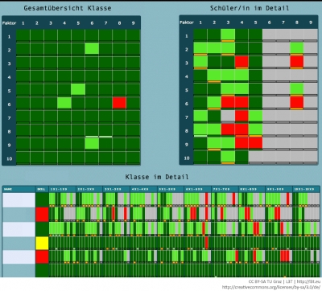

Der Begriff Learning Analytics tauchte erstmalig, eingebunden in eine ökonomische Analyse, in der Aufzählung von „key opportunities“ bei John Mitchell und Stuart Costello (2000, 16) auf. Danach dauerte es gut zehn Jahre, bis sich im Umfeld von George Siemens und den Learning Analytics &amp; Knowledge Konferenzen (LAK) ein Konsens herausgebildet hat, unter Learning Analytics das Sammeln von Daten von Lernenden zu verstehen, um deren Lernen unterstützen und den Erfolg prognostizieren zu können: „Learning analytics is the use of intelligent data, learner-produced data, and analysis models to discover information and social connections for predicting and advising people's learning.“ (Siemens, 2010).

Erstes, nachstehendes, Element wird ans Ende der vorherigen Seite gestellt

Seit dem erfährt der Forschungsbereich stetigen Aufschwung, was sich auch in der Nennung des Horizon Report (siehe #zukunft) nachhaltig niederschlägt, in dem von anerkannten Expertinnen und Experten dieser Tätigkeitsbereich als einer der wichtigsten in den nächsten Jahren deklariert wurde (Buckingham Sum, 2012).

<blockquote style="background: #B3E5FC; border-left: 10px solid #039BE5">

### !

Learning Analytics ist die Interpretation von lernerinnen- und lernerspezifischen Daten, um individuelle Lernprozesse gezielt zu verbessern. LA stellt dazu dem Lehrpersonal Werkzeuge bereit. Lehrpersonen gelangen so an Informationen, die sie ohne solche Tools eventuell gar nicht einholen könnten, bleiben aber auch im Zentrum des pädagogischen Handelns.

</blockquote>

Diese im Merksatz dargestellte Auffassung von LA bedeutet eine gewisse Überlagerung mit dem Forschungsgebiet des EDM, jedoch bleibt bei LA die Lehrperson im Zentrum des pädagogischen Handelns. Nach dieser Definition erhält LA auch einen besonderen Akzent durch das Bemühen, Lernerfolge vorherzusagen und das Lernen zu unterstützen. Duval (2010) bemüht sich um Klärung des Verhältnisses, und akzentuiert sein Interesse am pädagogischen Aspekt des Datensammelns. Seiner Ansicht nach geht es darum, Spuren von Lernenden zu sammeln und für die Verbesserung des Lernens zu verwenden, wobei die Lehrperson (als Lernprozessbegleiter/in) die Interpretation vornehmen soll.

Analog zur Ausbreitung von EDM steigt die Bedeutung von LA in dem Maße, wie im Unterricht das Element des Vortragens immer mehr zurücktritt und die Inhalte, der Content, zunehmend über digitale Prozesse vermittelt werden. Somit erhält LA quasi automatisch eine schnell wachsende Datenbasis, um die Spuren von Lernprozessen zu verfolgen – ob die Analysen gehaltvoller werden, muss auch weiterhin einer kritischen Beobachtung unterzogen werden. Laut dem U.S. Department of Education &amp; Office of Educational Technology (2012, 5) geht es zukünftig nicht darum, dass alle Lernenden das gleiche Seminar besuchen, die gleichen Hausübungen in gleicher Abfolge erledigen und alles in derselben vorgegebenen Zeit vollziehen. Stattdessen steht die Förderung des Individuums mit Hilfe individueller digitaler Lernunterlagen und anhand individueller Lernprozesse im Mittelpunkt.

Die Stärke von Learning Analytics liegt in der Möglichkeit, feinkörnige Beobachtungen von Prozessen auch mit sehr großen Probandinnen- und Probandenzahlen zu betreiben. Vor dieser Möglichkeit wurden von Forscherinnen und Forschern auch im pädagogischen Feld zur Datenreduktion schon ‚auf Papier‘ Detaildaten zu Testwerten zusammengefasst und verrechnet, dabei waren viele komplexere Auswertungsverfahren aus Speichergründen auf 50 bis 80 Variablen begrenzt. Es zeichnet sich nun also ab, dass mit den heutigen und zukünftigen technischen Möglichkeiten des Internets und zentralen Datenspeicherungen auf einem sehr differenzierten Niveau individuell gezeichnete Spuren verfolgt werden können.

Hiermit eröffnen sich ganz neue Forschungsfragen und -felder. Die großen Datenmengen erlauben Statistikerinnen und Statistikern sowie anderen fachkundigen Personen gänzlich neue Einblicke. Allerdings soll auch mit Boyd und Crawford (2011, 2) kritisch unter anderem auf das Phänomen der Apophänie, hingewiesen sein. Apophänie meint die Tendenz unserer Wahrnehmung, Muster und Beziehungen auch in gänzlich zufälligen, bedeutungslosen Einzelheiten zu konstruieren – dabei liefern die aufwändigen Verfahren den Forschenden implizit immer ‚irgendwelche‘ Ergebnisse. Chatti et al. (2012) weisen in ihrem Referenzmodell ebenfalls auf die Komplexität von LA hin, indem sie vier Bereiche benennen, die es zu bedenken gibt: Daten und Umgebungen (Was?), Stakeholder (Wer?), Ziel (Warum?) und die Methoden (Wie?).

<blockquote style="background: #FFEBEE; border-left: 10px solid #F44336">

### ?

Unter welchen Bedingungen fühlen Sie sich als Lehrperson durch LA in Ihrem Umfeld belastet? Worin könnte eine Entlastung liegen?

</blockquote>

### In der Praxis: Mathetrainer der TU Graz

An der Technischen Universität Graz werden mathematische Trainer entwickelt, die helfen sollen, die mathematische Grundausbildung der Grundschule zu unterstützen. Unter [http://mathe.tugraz.at](http://mathe.tugraz.at) sind derzeit der Einmal-Eins-Trainer, der Additions- und Subtraktions-Trainer und der mehrstellige Multiplikations-Trainer verfügbar. Alle Ressourcen sind frei zugänglich und können sowohl von Schulen als auch Privatpersonen genutzt werden (Beschreibung siehe Ebner et al., 2013b).  
</blockquote>  
Der an der TU Graz entwickelte Einmal-Eins-Trainer http://einmaleins.tugraz.at) verfügt über einen intelligenten Algorithmus, welcher versucht, den Wissenstand der Lernenden zu ermitteln und danach ein entsprechendes (weder zu leichtes noch zu schwieriges) Beispiel zu präsentieren. Wird ein Beispiel zweimal hintereinander richtig gelöst, wird es als ‚gut gekonnt‘ markiert. Das Trainer gilt als abgeschlossen, wenn alle Rechnungen gut gekonnt werden. Für die Lehrperson wird eine Übersicht angeboten (siehe Abb. 1), in der genau der Lernstand der Schulkinder nachvollzogen werden kann. Dunkelgrün entspricht gut gekonnt, grün heißt gekonnt, rot meint falsch und grau bedeutet noch nicht zugewiesen. Entscheidend ist aber die Markierung unter der Spalte ‚Skill‘. Hier wird in den Ampelfarben markiert, ob eine pädagogische Intervention vorgeschlagen wird:

Der Algorithmus erkennt, wenn über eine längere Periode falsche Lösungen eingegeben werden und stellt dies in der Farbe rot dar, gelb bedeutet, dass in letzter Zeit vermehrt Fehler aufgetreten sind, und grün, dass die einzelnen Lernenden vorankommen, Lernzuwachs verzeichnen. Also auch bei der Signalfarbe grün dürfen Fehler gemacht werden, aber insgesamt ist ein Lernzuwachs zu verzeichnen. Der Einmal-Eins-Trainer verfügt mit Stand August 2013 über mehr als 250000 Einträge von Rechnungen in der Datenbank und ist insofern weltweit einzigartig. Als Ergebnis zeigt sich, dass zum Beispiel die Rechnungen 6\*8 und 7\*8 eine höhere Fehlerrate aufweisen als die umgekehrten Operation (8\*6 und 8\*7). Eine mögliche Erklärung ist, dass in der Schulklasse zwar die 6er-Reihe gelernt und automatisiert wird, die Umkehrung aber sehr lange als eigenständige Rechnung der später gelernten 8er-Reihe betrachtet wird.

<figure>
  
  <figcaption>Abb. 1: Einmal-Eins-Trainer ([http://einmaleins.tugraz.at](http://einmaleins.tugraz.at)) - Übersicht über eine Klasse (anonymisiert)</figcaption>
</figure>

