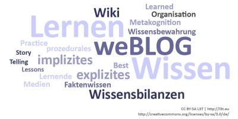

Im Folgenden werden zentrale Begriffe, mit denen sich WM beschäftigt, erläutert und darauf eingegangen, für welche Probleme WM Konzepte anbietet.

Wissen aus der Managementperspektive zu betrachten, gibt einen eingeschränkten Korridor an Interpretationsmöglichkeiten des Wissensbegriffs vor. Der Managementbegriff beschreibt entweder eine Personengruppe mit bestimmten Rollen und Tätigkeiten in einer Organisation (institutionale Sicht nach Haun, 2002, 30-31) oder eine Funktion welche vor allem mit den Tätigkeiten der Planung, des Kontrollierens und Entscheidens betraut ist (funktionale Sicht nach Schulte-Zurhausen, 1999, 13).

In beiden Fällen zielt WM darauf ab, Geschäftsziele systematisch zu unterstützen. WM dient also der Problemlösung ökonomischer Aufgaben wie beispielsweise der Optimierung der Ressourcenallokation (welche sich mit der Frage „Wovon benötige ich wie viel an welcher Stelle zu welchem Zeitpunkt?“ beschäftigt) oder der Generierung von Wettbewerbsvorteilen. Wie wichtig WM für die deutsche Wirtschaft ist, stellen Pawlowsky et al. (2010) im Rahmen der Studie ‚Wettbewerbsfaktor Wissensmanagement 2010‘ deutlich heraus. Die konkrete Aufgabe des WM ist es nach Reinmann und Eppler (2008) dabei ein „Unternehmen wissensbasiert zu gestalten oder organisationale Lernprozesse so zu steuern, dass man die Ressource Wissen optimal nutzen kann“ (Reinmann &amp; Eppler, 2008, 27.). Auch Probst et al. (2006) halten fest: „Wissensmanagement bildet ein integriertes Interventionskonzept, dass sich mit den Möglichkeiten der Gestaltung der organisatorischen Wissensbasis befasst“ (Probst et al., 2006, 23).

<figure>
  
  <figcaption>Abb. 1: Informelles Lernen im Spannungsfeld des betrieblichen Wissensmanagements</figcaption>
</figure>

Da wir in diesem Artikel eine kurze Einführung in die Ausprägungen des WM geben wollen, bedeutet das, dass viele Ansätze des WM ausgeblendet werden, insbesondere auch das persönliche Wissensmanagement (zum persönlichen WM siehe Ausführungen von Reinmann und Eppler auf www.persoenliches-wissensmanagement.com). Wie Abbildung 1 verdeutlicht, gilt dies auch für den Bereich des Lernens. Wir gehen nur auf das informelle Lernen im betrieblichen Kontext ein, welches einen Teilbereich des informellen Lernens darstellt, da es verbindlich an Geschäftszielen ausgerichtet sein sollte.

<blockquote style="background: #B3E5FC; border-left: 10px solid #039BE5">

### !

Lernen im betrieblichen Kontext sollte immer die Geschäftsziele unterstützen!

</blockquote>

Denn wie im Kapitel #unternehmen erläutert, entscheidet die Geschäftsführung über die langfristige Ausrichtung der Weiterbildung, die bestehende Infrastruktur und darüber, wer, wozu qualifiziert werden soll. Wie Robes dort unter anderem feststellt, eignet sich das informelle Lernen insbesondere für Zielgruppen, die selbstorganisiert lernen und arbeiten können. Entsprechend kommen informelle Lernformen besonders Expertinnen und Experten oder sogenannte Wissensarbeiterinnen und Wissensarbeitern (North und Güldenberg, 2008, 79 ff.) entgegen, was auch die Auswahl der Befragten in der aktuellen Hays Studie ‚Wissensarbeiter und Unternehmen im Spannungsfeld‘ (Stiehler et al., 2013) widerspiegelt. Trotzdem bleibt festzuhalten, dass prinzipiell alle Mitarbeiter/innen informell lernen können und dies mehrheitlich auch tun. Entsprechende Rahmenbedingungen, die durch das Unternehmen gesetzt werden, können die Selbstlernkompetenzen fördern.

Erstes, nachstehendes, Element wird ans Ende der vorherigen Seite gestellt

Diese Selbstlernkompetenz könnte man auch als das Vorhandensein eines Sets bestimmter Kenntnisse und Vorstellungen beziehungsweise Erfahrungen beschreiben, wie man selbstgesteuert lernt. Spezialbegriffe spielen in der Begriffslandschaft des WM eine große Rolle, können aufgrund ihrer Vielzahl aber an dieser Stelle nicht angemessen erläutert werden.

Darum haben wir uns entschlossen die wichtigsten Begriffe nachfolgend als Tag-Cloud abzubilden und die Begriffserläuterung auf eine Google-Page auszulagern. Dies ermöglicht zugleich eine vielfältige Interaktion für die Lesenden und ermöglicht weitere eigene informelle Lernerfahrungen.

<figure>
  
  <figcaption>Abb. 2: Begriffslandschaft des Wissensmanagements</figcaption>
</figure>

Die entsprechenden Erläuterungen der Begriffe aus Abbildung 2 sind unter [http://tinyurl.com/mpxjc9h](http://tinyurl.com/mpxjc9h) abzurufen. Wir möchten alle Interessierten an dieser Stelle damit einladen sich zu beteiligen, um aus dem L3T-Artikel ein informelles Lernprojekt zu machen.

<blockquote style="background: #FFEBEE; border-left: 10px solid #F44336">

### ?

Kommentieren Sie einen der oben genannten Begriffe oder ergänzen Sie eine weitere Definition auf der Google-Page: [http://tinyurl.com/mpxjc9h](http://tinyurl.com/mpxjc9h)

</blockquote>
