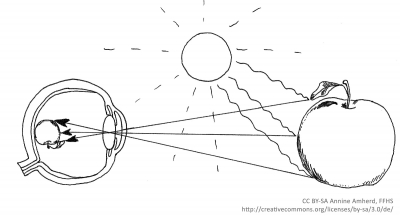

Unsere Sinnesorgane bilden gewissermaßen das Tor zu unserer Umwelt. Über diese Schnittstellen nehmen wir Informationen unserer Umgebung auf, welche wiederum die Grundlage für ein angemessenes Agieren und Handeln in einer Situation sind. Diese Informationen treffen dabei als physikalische Reize auf unsere Sinnesorgane, werden in einem komplexen Prozess über mehrere Stufen hinweg verarbeitet und münden schließlich in unserem subjektiven Erleben der Umwelt. Diesen Wahrnehmungsprozess zu verstehen, ist das Ziel der Wahrnehmungspsychologie (Goldstein, 2008, 8).

Wir befassen uns hier ausschließlich mit visueller Wahrnehmung. Am Beispiel der Betrachtung eines Apfels wird kurz die Funktionsweise des Auges erklärt (Abbildung 1): Lichtstrahlen treffen auf den Apfel, werden dort reflektiert und fallen hierbei als physikalische Reize durch die Linse des Auges hindurch auf die Netzhaut. Auf ihr entsteht dadurch ein Abbild des Apfels. Die von außen eintreffenden physikalischen Reize werden von auf der Netzhaut befindlichen Fotorezeptoren in elektrische Signale umgewandelt. Diese Signale gelangen nun über Nervenbahnen ins Gehirn. Die Verarbeitung der Informationen geschieht dabei äußerst rasch (Goldstein, 2008).

Unser Sehvermögen vermittelt uns, dass wir alles in unserem Blickfeld lückenlos wahrnehmen. Tatsächlich ist die visuelle Wahrnehmung aber staccatoartig und ein ständiges Wechselspiel zwischen kurzen Verweilzeiten auf Objekten unseres Interesses (Fixationen) und Sprüngen zu neuen Umweltreizen (Sakkaden). Diese Strategie ist notwendig, da der Umfang der einwirkenden visuellen Umweltreize enorm ist und es ohne diesen Selektionsprozess zu einer kognitiven Überlastung des Gehirns kommen würde. Außerdem können lediglich zwei Grad unseres visuellen Sehfeldes scharf wahrgenommen werden. Dies können Sie in einem kleinen Experiment selber erforschen: Wenn Sie Ihren Arm ausstrecken und Ihren Daumen betrachten, dann ist ungefähr die Dicke Ihres Daumens scharf, der Rest Ihres Sichtfeldes wirkt unscharf (Duchowski, 2007).

<figure>
  
  <figcaption>Abb. 1: Funktionsweise des Auges.</figcaption>
</figure>

Wesentlich für das menschliche visuelle System ist des Weiteren, dass die Steuerung der Aufmerksamkeit sowohl bewusst als auch unbewusst stattfindet. Der Mensch glaubt, die Wahrnehmung ständig zu lenken, jedoch sind viele unbewusst ablaufende Vorselektionsprozesse aktiv. Diese können für das Lernen und Lehren mit Technologien ausgenutzt werden, um die Aufmerksamkeit der Lernenden im Sinne der oben angesprochenen Steigerung der Effektivität, Effizienz oder Zufriedenheit zu lenken. Als Beispiel kann der sogenannte Pop-Out-Effekt genannt werden, welcher in der Infobox näher erläutert wird. Tipps aus der Praxis, wie Sie einen Mehrwert erreichen können, werden im nachfolgenden Kapitel angeführt.

Als eines der markantesten Beispiele der unbewussten Aufmerksamkeits-steuerung kann der Pop-Out-Effekt genannt werden. Dieser kann in jener Art eingesetzt werden, dass im Laufe des Lernprozesses bestimmte Inhalte visuell nicht übersehen, respektive leicht fokussiert werden können. Vereinfacht ausgedrückt springen diese Inhalte sozusagen in das Auge der Betrachtenden. Des Weiteren ermöglicht der Pop-Out-Effekt eine schnelle Informationsverarbeitung, ohne dabei auf die bewusste Aufmerksamkeit der Lernenden angewiesen zu sein.

Als Beispiel sei an dieser Stelle das Zählen der Ziffer 3 in einer langen Zahlenkette zu nennen (Ware, 2000). Ohne farbliche Formatierung wäre eine länger andauernde sequenzielle Abarbeitung der Zeichenkette notwendig, um die entsprechenden Ziffern zu finden. Der Pop-Out-Effekt, welcher in diesem Fall durch den Kontrastunterschied entsteht, begünstigt ein visuelles „Abheben des Zielreizes“ von den Ablenkern, wie es in Abbildung 2 dargestellt ist. Neben Kontrasten (zum Beispiel Helligkeit, Farbe oder Form) kann ein Pop-Out-Effekt besonders gut auch durch Bewegungen oder Blinken erzeugt werden (Goldstein, 2008).

Menschliche Wahrnehmung ist aber nicht nur sprunghaft, sondern auch aktiv (Ware, 2008). Menschen wenden sich Bereichen zu, in denen sie interessante und wesentliche Informationen vermuten. In der Regel haben sie bestimmte Hypothesen darüber, wo es wesentliche Informationen gibt und wie diese zu interpretieren sind (zum Beispiel Lindsay &amp; Norman, 1981). Wenn wir einen Text lesen, haben wir in der Regel vorab schon bestimmte Erwartungen, welche Informationen dieser Text enthalten wird. Wenn diese Erwartungen nicht erfüllt sind, kommt es manchmal zu Störungen in der Wahrnehmung. Da wir beispielsweise davon ausgehen, dass Texte korrekt getippt sind, fällt es uns schwer, Tippfehler zu entdecken. Wahrnehmungsprozesse funktionieren daher nicht nur bottom-up (von den Reizen zur Speicherung im Gedächtnis), sondern auch top-down (vom Gedächtnis zu den Sinnesorganen, deren Funktionieren von den Erwartungen geleitet wird). Die Einbeziehung der Erwartungen und des Kontexts führen dazu, dass menschliche Wahrnehmung sehr rasch abläuft, aber dafür auch fehleranfällig ist. Derartige Prozesse sollten im Design von Lernsystemen berücksichtigt werden.

<figure>
  
  <figcaption>Abb. 2: Der Pop-Out-Effekt begünstigt eine rasche Informationsverarbeitung.</figcaption>
</figure>

Es gibt eine Wahrnehmungstheorie, die für das Design von Benutzer/innen-Oberflächen besonders wesentlich ist - die Gestaltpsychologie. Diese Theorie besagt, dass wir Dinge ganzheitlich wahrnehmen und Gegenstände gruppieren. Objekte, die nahe beieinander angeordnet und durch einfache geometrische Formen von anderen Objekten abgegrenzt sind, werden als zusammengehörig empfunden. Einfachstes Beispiel hierzu sind die in vielen Betriebssystemen verwendeten Fenster für die Gruppierung von Dateien. Diese Tatsache wird in der visuellen Gestaltung dazu genutzt, die Wahrnehmung auch zu führen.

Doch wie werden nun die Augenbewegungen aufgezeichnet und für die gestalterische Optimierung visueller Reize nutzbar gemacht? Heutzutage kommt gerade im kommerziellen Bereich (beispielsweise im Marketing und in der Werbeforschung) meist die Infrarotmethode zum Einsatz, weshalb hier aus Gründen der Übersichtlichkeit nur diese kurz vorgestellt werden soll. Bei dieser Methode wird infrarotes Licht von einem Gerät, dem sogenannten Eye-Tracker, ausgestrahlt und das von der Hornhaut (Cornea) reflektierte Infrarotlicht dann von einem Sensor des Eye-Trackers wieder aufgefangen. Aufgrund eines vorherigen Kalibrierungsprozesses kann anhand der Geometrie dieser Reflexionspunkte anschließend die Blickrichtung sehr präzise bestimmt werden (Zu weiteren Methoden der Blickregistrierung siehe beispielsweise Duchowski, 2007).

Wieso aber sind Blickbewegungen für das Lernen so wichtig? Grundsätzlich legt man zwei Annahmen von Just und Carpenter (1980) der Interpretation von Augenbewegungen zu Grunde: Erstens die *Eye-Mind-Assumption*, welche unterstellt, dass die aktuell betrachtete visuelle Information auch aktuell kognitiv erfasst/verarbeitet wird. Visuelle Informationen, welche in günstiger Form dargeboten werden (siehe die Gestaltungsempfehlungen im nachfolgenden Kapitel), können demzufolge einfacher erfasst und verarbeitet werden, was die kognitiven Ressourcen der Lernenden schont. Zweitens die *Immediacy-Assumption*, wonach die längere Fixation eines visuellen Reizes auch eine intensivere geistige Bearbeitung bedeutet. Allerdings können lange Betrachtungszeiten auch gerade ein Hinweis darauf sein, dass der betrachtete Stimulus entweder sehr schwer erkennbar (beispielsweise sehr klein gedruckter Text) oder aber sehr schwer zu verstehen (beispielsweise in einer Fremdsprache verfasster Text) ist. Blickbewegungen können demzufolge einen Rückschluss auf Aufmerksamkeitsprozesse zulassen (mehr zu spezifischen Interpretationsansätzen von Sakkaden und Fixationen siehe Holmqvist et al.,2011).

Die Relevanz der visuellen Wahrnehmung und damit auch der Notwendigkeit geeigneter Messmethoden kann also nicht genug betont werden: Untersuchungen aus dem Bereich der Arbeitspsychologie zeigen beispielsweise, dass ein Großteil der relevanten Arbeitsinformationen visueller Natur sind (Holmqvist et al., 2011). Dies dürfte beim Lernen nicht anders sein.
