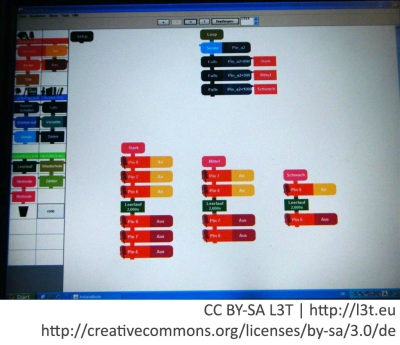

Durch die Auswahl von Materialien und Themen können Projekte auch für jene Menschen attraktiv werden, die sich selbst zunächst nicht in der Rolle der Technologiegestalter/innen sehen. In welchem Rahmen (Tageszeitung, Internet, Schule, interkulturelles Jugendzentrum, Mädchengruppe, etc.) und durch welche Vorbilder öffentliche Veranstaltungen wie Workshops beworben und ausgeschrieben werden, beeinflusst die Zusammensetzung der Gruppe der Teilnehmenden z. B. bezüglich vorhandenem Technikinteresse, Geschlecht, Migrationsstatus oder Bildungshintergrund. Dieser Abschnitt zeigt anhand von fünf konkreten Beispielen unterschiedliche Rahmen, in denen konstruierendes Lernen mit Technologie umgesetzt werden kann.

## TechnikBasteln

Bei TechnikBasteln ([http://www.technikbasteln.net](http://www.technikbasteln.net)) sollen Kinder in Workshops für IKT begeistert, aber auch ausführlich über verschiedene Technologien informiert werden. In Workshops zur Funktionsweise von Computern wird die Geschichte der Entwicklung von Computern erläutert und die diversen Hardware-Komponenten sowohl in ihrer Funktionsweise als auch in ihrem Beitrag im Gesamtsystem erfahrbar gemacht. Dabei werden den Kindern die Komponenten wie Prozessoren, Festplatten, Arbeitsspeicher und Motherboards im Sinne einer haptischen Erfahrung auch zum ‚Be-greifen‘ angeboten.

Im Hauptteil des Workshops zerlegen die Kinder in Kleingruppen dann Laptops, um Einblicke in das Innenleben zu erhalten und die Scheu vor dem Anfassen technologischer Bauteile zu verlieren und um selbst tätig zu werden. In anderen Workshops werden anhand von spielerischen Einzel- und Gruppenaktivitäten Themen wie die Auswahl von sicheren Passwörtern erarbeitet oder die grundlegende Funktionsweise des Versands von E-Mails mithilfe einer Wäscheleine, Papier und Bleistift erklärt.

## Innovationscamp

Ferienprogramme ermöglichen Kindern und Jugendlichen eine vielseitige Auseinandersetzung mit Technologie außerhalb etablierter pädagogischer Institutionen. Das Innovationscamp Bremen, eine Initiative der Universität Bremen, der Jacobs University und der Handelskammer, nutzte die Räumlichkeiten der Jugendherberge, um eine Woche lang anhand der Themen ‚Sport und Technologie‘, ‚Mobile Roboter‘ und ‚Humanoide Roboter‘ den kreativen Umgang mit Technologie zu vermitteln ([http://www.innovationscamp.de](http://www.innovationscamp.de)). Dabei waren die Jugendlichen in Altersgruppen von 9-13, 11-15 und 13-17 Jahren aufgeteilt. 15 Teilnehmende pro Gruppe wurden akzeptiert, wobei auf eine ausreichende Betreuung durch Wissenschaftler/innen und Studierende der Universitäten geachtet wurde.

## Robotik

Für Jugendliche im Alter von 10-19 Jahren bietet die internationale Bildungsinitiative *RoboCupJunior* die Möglichkeit, im Rahmen von nationalen und internationalen Team-Wettbewerben ihre im Unterricht oder in der Freizeit entwickelten und programmierten Roboter gegeneinander antreten zu lassen. Die Aufgaben in den drei frei wählbaren Kategorien ‚Dance‘, ‚Rescue‘ oder ‚Soccer‘ werden meist mit *Lego®-Mindstorms-NXT-*Robotern oder mit Robotern auf *Arduino*-Basis gelöst (*Arduino* dargestellt in Abbildung 3). Die nationalen *RoboCupJunior*-Vereinigungen unterstützen Gruppen und Betreuende beim Einstieg in *RoboCupJunior*.

Für Kinder im Kindergarten-, Vorschul- und Primarstufenalter werden allgemein immer mehr sogenannte Bodenroboter zum spielerischen Programmieren verwendet. Einer der bekanntesten Hersteller in diesem Bereich ist die *TTS Group* mit ihren Bodenrobotern *Bee-Bot* und *Pro-Bot*. Während der *Bee-Bot* einfache Befehlsabfolgen (mit Tastendruck – vorwärts, rückwärts, Links- und Rechtsdrehung) beherrscht, kann der *Pro-Bot* direkt per Tastendruck oder über USB-Kabel mit PC-Software programmiert werden. Basis ist die Programmiersprache Logo, die von Papert entwickelt wurde (Stöckelmayr et al., 2011). Eine Alternative ist zum Beispiel der *Roamer*, welcher ebenfalls auf der Programmiersprache Logo basiert. (Nähere Informationen unter: [http://www.valiant-technology.com/uk/pages/roamer\_diversity.php](http://www.valiant-technology.com/uk/pages/roamer_diversity.php))

<figure>
  
  <figcaption>Abb. 3: Der programmierbare Mikrocontroller Arduino kann in Workshops vielseitig Verwendung finden. Es können zum Beispiel Lichter oder Motoren gesteuert und durch angeschlossene Sensoren unterschiedliche Aspekte der Umwelt gemessen werden.</figcaption>
</figure>

## Pädagogik-Studium

Erstes, nachstehendes, Element wird ans Ende der vorherigen Seite gestellt

Das Technologieinteresse bei pädagogischen Fachkräften sollte idealerweise schon in der Ausbildung geweckt werden, damit diese später eine Vorbildfunktion einnehmen können. In medienpädagogischen Seminaren für (programmierunerfahrene) Studierende des Lehramts oder der Sozialpädagogik kann durch eine spielerische Herangehensweise an das Programmieren eine mögliche anfängliche Unsicherheit abgebaut werden. Der Einstieg in die Grundprinzipien der Sensorsteuerung und die Reflexion ihres Vorkommens in der Alltagsumgebung mit dem Ziel, Technologieinteresse zu wecken, könnte über kurze Internet-Videos erfolgen.

In anschließenden Präsenzeinheiten können verblüffende Konstruktionen und Programmierungen mit Arduino-Microcontrollern, LED-Lampen und Piezo-Lautsprechern experimentell durchgeführt werden. Abschließend könnten Erfahrungen reflektiert und die Relevanz von technologischen Entwicklungen für die Gesellschaftsentwicklung diskutiert werden.

## FabLabs

FabLabs gibt es inzwischen in vielen größeren Städten. Das sind offene Werkstätten, in denen der Zugriff auf moderne Fabrikationsmaschinen wie 3D-Drucker und Laser-Cutter geboten wird. Ein wichtiger Aspekt ist der Freiraum, der interessierte Laiinnen und Laien zur Entwicklung und Umsetzung eigener Produktideen animiert und Wissensaustausch fördert. Auch organisierte Workshops finden in FabLabs statt. ‚Elektronik für Tomatenzüchter und andere Pflanzenliebhaber‘ ist beispielsweise ein Angebot des FabLabs München, das sich an Neulinge auf dem Gebiet der Elektronik richtet ([http://wiki.fablab-muenchen.de/display/WIKI/Programm](http://wiki.fablab-muenchen.de/display/WIKI/Programm)). Ein solches Workshopangebot zeigt, wie eine konstruierende Auseinandersetzung mit Technologie anhand der Umsetzung von persönlich relevanten Projekten stattfinden kann.

<blockquote style="background: #FFEBEE; border-left: 10px solid #F44336">

### ?

- Für welche Zielgruppe in Ihrem Arbeitsumfeld wäre es sinnvoll, ein Konstruktionsprojekt durchzuführen? Welche Rahmenbedingungen finden Sie vor? Wo könnten Sie sich Unterstützung für Ihr Vorhaben holen?
- Wofür steht die Abkürzung ‚MINT‘? Finden Sie eine Definition und beschreiben Sie ‚MINT‘ in maximal drei Sätzen.
- Diskutieren Sie, ob und warum naturwissenschaftlich-technische Bildung bereits im Kindergartenalter wichtig ist.
- Entwickeln Sie ein Konzept für einen Konstruktionsworkshop für Mädchen im Alter von 12-16 Jahren!

</blockquote>

Erstes, nachstehendes, Element wird ans Ende der vorherigen Seite gestellt

</blockquote>

## Materialien und Überblick über Bezugsquellen und Kosten

- *EduWear Kit* - Tragbare Intelligenz – für Tasche, Tanz und Tennis ab ca. 100 EUR bei [http://www.watterott.com/de/EduWear-Kit](http://www.watterott.com/de/EduWear-Kit)
- Anleitung für den Bau eines interaktiven Teddys [http://dimeb.informatik.uni-bremen.de/eduwear/wp-content/uploads/manual/anleitung\_teddy.pdf](http://dimeb.informatik.uni-bremen.de/eduwear/wp-content/uploads/manual/anleitung_teddy.pdf)
- *Bee-Bot* - Bodenroboter ab ca. 50 EUR und Zubehör u.a. erhältlich bei [http://www.tts-group.co.uk](http://www.tts-group.co.uk)
- *Roamer* - Bodenroboter ab ca. 100 EUR erhältlich bei [http://www.valiant-technology.com/shop/shop.php?id=0id0&amp;cat=10](http://www.valiant-technology.com/shop/shop.php?id=0id0&cat=10)
- *Lego®-Mindstorm-NXT*-Roboter ca. 400 Euro, können jedoch oftmals bei den Regionalzentren der RoboCupJunior-Vereinigung ausgeliehen werden.
- *Arduino-Microcontroller*, der sich ebenfalls zur Steuerung und Programmierung von Robotern eignet, ca. 25 Euro, z. B. [http://www.physicalcomputing.at](http://www.physicalcomputing.at), [http://dimeb.informatik.uni-bremen.de/eduwear/wp-content/uploads/manual/anleitung\_teddy.pdf](http://dimeb.informatik.uni-bremen.de/eduwear/wp-content/uploads/manual/anleitung_teddy.pdf)

## Beispiele von Technologien

- *App Inventor* ([http://appinventor.mit.edu/](http://appinventor.mit.edu/)): App-Entwicklung für Handys
- *Amici* ([http://dimeb.informatik.uni-bremen.de/eduwear/](http://dimeb.informatik.uni-bremen.de/eduwear/)) oder LEGO®-Robotik: Erste Programmiererfahrungen mithilfe von grafischen Bausteinen
- *Alice* ([http://www.alice.org/](http://www.alice.org/)): Objektorientierte Programmierung von Animationsfilmen oder einfachen Computerspiele
- *Arduino* ([http://www.arduino.cc](http://www.arduino.cc)): Programmierbarer Mikrocontroller mit passender Software und vielen Beispielen
- *MaKey MaKey* ([http://www.makeymakey.com/](http://www.makeymakey.com/)): Bausatz, der es ermöglicht, statt Tastatur oder Maus alle (un-)denkbaren Materialien und Gegenstände (Bananen, Wasser, Knetgummi etc.) zur Steuerung eines Computers zu verwenden
- *Processing* ([http://processing.org/](http://processing.org/)): Programmiersprache und Arbeitsumgebung für den Einstieg in die Programmierung von interaktiven, visuellen und künstlerischen Anwendungen
- *Scratch* ([http://scratch.mit.edu](http://scratch.mit.edu)): Visuelle Programmiersprache und Entwicklungsumgebung für die einfache Erstellung von Animationen, interaktiven Geschichten und Spielen

</blockquote>

<figure>
  
  <figcaption>Abb. 4: Visuelle Programmiersprache mit Drag-&amp;-Drop-Funktionalität</figcaption>
</figure>

## Angebote/Projekte

- *Otelo* - das ‚offene Technologie Labor‘ ist ein gemeinnütziger Verein, um Menschen, Ideen und Technologie zusammenzuführen und Räume sowie Basisinfrastruktur für ‚kreative und technische Aktivitäten‘ ([http://www.otelo.or.at](http://www.otelo.or.at)) bereitzustellen. Das Konzept findet auch im ‚Hand(lungs)buch‘ nähere Erläuterung ([https://www.dropbox.com/s/bsvcdiqj5lzs8bs/Handlungsbuch\_Version\_1.0.pdf](https://www.dropbox.com/s/bsvcdiqj5lzs8bs/Handlungsbuch_Version_1.0.pdf)).
- *TechKreativ* bietet konstruktionistische Workshops in Verbindung mit Technologie zu unterschiedlichen Themen wie Robotik, Tanz, Sport oder Musik für Kinder und Jugendliche, aber auch als Aus- und Weiterbildung für Unternehmen und Betriebe ([http://techkreativ.de/](http://techkreativ.de/)).
- *Pfiffy* bietet altersgerechte, wissenschaftlich und pädagogisch fundierte Kurse für einen spielerischen Einstieg in Technik und Naturwissenschaften für Kinder im Kindergarten- bis Primarstufenalter an ([http://www.pfiffy.eu](http://www.pfiffy.eu)).
- Österreichs Universitäten mit Informatik-Studiengängen führen Jugendliche mit ihrer Initiative *You can make IT* an das Informatikstudium heran ([http://youcanmakeit.at/](http://youcanmakeit.at/)).
- *RailsGirls* ([http://railsgirls.com](http://railsgirls.com)) ist eine global verbreitete Initiative, um Frauen für Programmierung zu begeistern.
- Im Projekt ‚*Informattraktiv* - eine Informatik, die für Frauen und Mädchen attraktiv ist‘ ([http://www.dimeb.de/informattraktiv](http://www.dimeb.de/informattraktiv)) werden durch die Untersuchung des öffentlichen Bildes der Informatik Innovationsimpulse gewonnen, die zu zeitgemäßen Forschungsfragen sowie einer attraktiven Ausrichtung und Wahrnehmung des Faches führen (siehe auch Abbildung 1).

## Robotikaktivitäten

- *RoboCupJunior* in Deutschland ([http://rcjd.de/](http://rcjd.de/)), Österreich ([http://robocupjunior.at/](http://robocupjunior.at/)) und der Schweiz ([http://robotexchange.ch/](http://robotexchange.ch/))
- *First Lego® League* ([http://www.firstlegoleague.org](http://www.firstlegoleague.org)) ist in über 70 Ländern mit mehr als 20.000 Teams aktiv. Sie ist ein Robotik-Programm für Kinder und Jugendliche im Alter von 9 bis 16 Jahren mit dem Ziel, Kinder für Wissenschaft und Technologie zu begeistern und ihnen Kompetenzen für ihr Leben und die spätere Arbeitswelt zu vermitteln.
- Seit 2004 ist die *RobotChallenge* ([http://www.robotchallenge.org/de](http://www.robotchallenge.org/de)) ein jährlicher Treffpunkt und eine der weltweit größten Meisterschaften in 15 Disziplinen für selbst gebaute, autonome und mobile Roboter, an der Anfänger/innen und Profis gleichermaßen teilnehmen können.
- Die *Roberta® Initiative* ([http://www.roberta-home.de/](http://www.roberta-home.de/)) bietet neben Roboterkursen mit ca. 1000 zertifizierten „Roberta®-Teachern” auch Lehrer/innen Trainings in den Roberta® Zentren an, um gendergerechte praxisnahe Roboterkurse für Mädchen und Jungen abhalten zu können.
- Im Rahmen der ‚Langen Nacht der Forschung‘ der Region Tirol ([http://www.tiroler-forschungsnacht.at/ 2012](http://www.tiroler-forschungsnacht.at/%202012)) veranstaltet die Universität Innsbruck Roboter-Workshops für Kinder, wobei auch Erwachsene großes Interesse zeigen.

</blockquote>

- Das *TiRoLab* und das *Institut zur Förderung des IT-Nachwuchses* sind Initiativen, die Robotikkurse für Kinder und Jugendliche anbieten, um Technologieinteresse zu fördern ([http://www.tirolab.at/](http://www.tirolab.at/), [https://www.facebook.com/ifit.org](https://www.facebook.com/ifit.org)).

## Literatur zum Einstieg

- Die *Roberta®*-Reihe herausgegeben vom Fraunhofer Verlag ([http://www.verlag.fraunhofer.de/bookshop/reihe/Roberta-Reihe-M%C3%A4dchen-erobern-Roboter](http://www.verlag.fraunhofer.de/bookshop/reihe/Roberta-Reihe-M%C3%A4dchen-erobern-Roboter)): Die Reihe präsentiert Lehr- und Lernmaterialien für Roboterkurse, die besonders auch für Mädchen interessant sind.
- Schelhowe (2007). Technologie, Imagination und Lernen. Grundlagen für Bildungsprozesse mit Digitalen Medien: Veranschaulicht die Relevanz von technologischem Lernen.
- Bartmann (2011). Die elektronische Welt mit Arduino entdecken.

## Lernmaterialien: Auflistung frei verfügbarer (open access) Inhalte

- Linkliste für viele IT-Themen: [http://www.technikbasteln.net/links/](http://www.technikbasteln.net/links/)
- Lerneinheiten für den Einsatz des *Roamer*-Bodenroboters für unterschiedliche Altersstufen: [http://www.valiant-technology.com/uk/pages/freestuff.php](http://www.valiant-technology.com/uk/pages/freestuff.php)
- Einheiten für das Programmieren mit *Kara* (Marienkäfer) auf *SwissEduc*: [http://www.swisseduc.ch/informatik/karatojava/](http://www.swisseduc.ch/informatik/karatojava/)
- Zusammenstellung und Anleitung mit diversen spielerischen Programmierangeboten auf dem Bildschirm für Kinder: [http://www.java-online.ch/](http://www.java-online.ch/)
