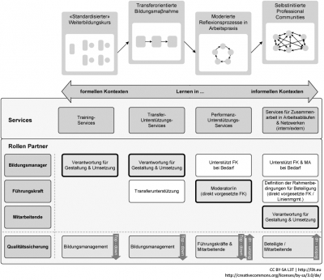

## Strategie und Portfolio an Bildungsmaßnahmen gestalten

Technologieunterstützte Lehr-Lern-Aktivitäten können in verschiedenen Kontexten stehen. Sie können ein Element von formal organisierten Kursen und Lehrgängen sein. Sie können ein Element von moderierten Lern- und Reflexionsprozessen am Arbeitsplatz/im Studienverlauf sein (zum Beispiel Action-Learning-Projekte oder Pflege eines Kompetenzportfolios), oder sie können ein Element von informellen, selbstgesteuerten Aktivitäten des Lernens und Wissensaustauschs sein (vgl. Abb. 3). Das Bildungsmanagement hat die Aufgabe, Lernprozesse auf individueller, betrieblicher und überbetrieblicher Ebene zu initiieren, zu implementieren, zu begleiten und zu evaluieren (Diettrich &amp; Vonken, 2009). Mit der Einführung von E-Learning treten neue Angebote an Bildungsmaßnahmen neben bereits etablierte: zum Beispiel rein online durchgeführte und auf WBT basierende Trainings; Blended-Learning-Angebote; unterstützende E-Services im Rahmen der Kompetenzentwicklung wie etwa E-Kompetenzportfolios oder Online-Lerngemeinschaften. Damit verändert sich die ‚Lernarchitektur‘ (vgl. Detecon International GmbH, 2006) und das Portfolio an Bildungsdienstleistungen (vgl. Abb. 3).

<figure>
  
  <figcaption>Abb. 3: Kontexte von technologieunterstützten Lehr- bzw. Lernaktivitäten und Service- Portfolio</figcaption>
</figure>

Die Grundsatzentscheidung für eine neue Leistungsstrategie des Bildungsmanagements unter Einbezug von E-Learning und ein verändertes Leistungsportfolio erfordern dann Folgeentscheidungen. Beispielsweise bezüglich der Frage, ob und in welchem Umfang personelle Ressourcen für neue Leistungsbereiche (zum Beispiel Erstellen von mobilen Lernapplikationen) aufgebaut oder ob hier mit externen Partnerinnen und Partnern zusammengearbeitet werden soll.

## Learning Design: Innovative Lernformen gestalten

Im Rahmen formal organisierter Lehr-/Lern-Prozesse stehen nicht technische Werkzeuge und Infrastrukturen am Anfang der Entwicklungsarbeit, sondern Lern- und Entwicklungsziele. Die nachfolgende Abbildung zeigt die hier zugrunde gelegte Logik: Ausgangspunkt für das didaktische Design sind die Lern- und Entwicklungsziele, die zu vermittelnden Inhalte und deren Abfolge. In einem nächsten Planungsschritt muss auf dieser Grundlage zunächst der Lehr-/Lern-Prozess geplant werden: über welche Lehr-Lern-Aktivitäten sollen die verschiedenen Lern- und Entwicklungsziele verfolgt werden?

Erst danach können in einem nächsten Schritt die geeigneten Materialien und Werkzeuge ausgewählt werden: Texte, Grafiken, Bilder und audiovisuelle Aufzeichnungen; Werkzeuge zur Kommunikation und Zusammenarbeit; Hilfsmittel zur Abfrage, Dokumentation und Darstellung/Visualisierung etc.

<figure>
  
  <figcaption>Abb. 4: Von den Zielen zu den Werkzeugen</figcaption>
</figure>

Auch im Kontext von informellem, selbstgesteuertem Lernen geht es nicht zuerst und prioritär um technische Infrastrukturen wie etwa Social-Media-Plattformen. Die Erfolgsfaktoren beispielsweise für Online-Lerngemeinschaften beschränken sich nicht nur auf Aspekte der technisch-organisatorischen Unterstützung (zum Beispiel technische Plattformen), sondern umfassen den Nutzen (zum Beispiel wichtige, gemeinsam getragene Ziele für die Kooperation der Beteiligten), die beteiligten Personen (zum Beispiel freiwillige, stabile Mitgliedschaft ohne Konkurrenzverhältnis der Mitglieder untereinander) und die Moderation (zum Beispiel sorgfältig gestalteter Start der Aktivitäten).

## Wertbeitrag erheben und weiterentwickeln

Eine nachhaltige Einführung von E-Learning erfordert, dass mit dieser Entwicklungsinitiative ein positiver Wertbeitrag verbunden ist und auch aufgezeigt werden kann. Die Bestimmung des „return on investment“ (ROI) galt für einige Zeit als der einzig richtige Weg auch bei der Einführung von E-Learning (entsprechende Fallstudien finden sich unter anderem bei Phillips &amp; Phillips, 2007a). Allerdings hat sich gezeigt, dass die Bestimmung des ROI auf der Grundlage einer tragfähigen Methodik (zum Beispiel Phillips &amp; Phillips, 2007b) sehr arbeitsaufwändig ist. Darüber hinaus ist die Bestimmung des ROI nicht für alle Anspruchsgruppen von überragender Bedeutung. Manche Anspruchsgruppen – zum Beispiel die direkten Auftraggeber/innen – mögen tatsächlich einen positiven „return on investment“ erwarten. Für andere Anspruchsgruppen dagegen können andere Aspekte als zentrale Werttreiber im Vordergrund stehen: die Passung von Bildungsdienstleistungen mit der strategischen Ausrichtung des Unternehmens (Unternehmensleitung), die reibungslose Koordination von Schulungen mit Produkt-Rollouts (Geschäftsbereiche in Unternehmen) oder die Reduktion der Abwesenheit vom Arbeitsplatz auf Seiten der Teilnehmenden (Vorgesetzte der Teilnehmenden).

Mit der Bewegung von „E-Learning 1.0“ zu „E-Learning 2.0“ rücken nicht nur andere Lehr-Lern-Szenarien in den Vordergrund (zum Beispiel Auseinandersetzung mit von den Lernenden selbst erzeugten (Mikro-)Inhalten – etwa in Wikis, Weblogs oder Twitter-Kanälen – und der mobile Zugriff auf Lernressourcen mit Smartphones oder Tablets; Arnold et al., 2011, 167-169; Kerres, 2012, 454-456), sondern auch andere Werttreiber. Je nach Anspruchsgruppe und Perspektive können beispielsweise Aspekte wie die Vereinfachung von Anmeldeprozessen, die Vereinheitlichung von Kurs- und Lerninhalten oder das schnelle Erreichen von weltweit verteilten Zielgruppen in den Hintergrund treten und Aspekte wie die Entwicklung und Verankerung einer neuen Lernkultur mit mehr Selbstbestimmung auf Seiten der Lernenden in den Vordergrund rücken. Grundsätzlich aber gilt, dass der Wertbeitrag der Einführung von E-Learning immer mit Blick auf die spezifischen Erwartungen der verschiedenen Anspruchsgruppen zu bestimmen ist („return on expectations“, ROE - Meier, 2012, 374).
