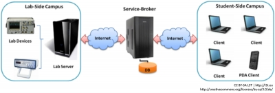

<!-- filename: 06_Foerderorganisationen.md -->
<!-- title: Förderorganisationen -->

In den letzten Jahren hat sich eine weltweite Gemeinschaft von Entwickelnden und Anwendenden von Online-Labor-Lösungen herausgebildet, die sich jährlich auf Konferenzen, Workshops und Sommerschulen trifft. Eine Trägerin dieser globalen Vernetzung ist die „**International Association of Online Engineering**“ (IAOE, [www.online-engineering.org](http://www.online-engineering.org)).

Im Juni 2010 wurde in Villach von Vertreterinnen und Vertretern des MIT, der FH Kärnten, der University of Queensland und der University of Technology Sydney das „**Global Online Laboratory Consortium**“ (GOLC) gegründet ([www.online-lab.org](http://www.online-lab.org)). Ziel dieses Konsortiums ist es, die Entwicklung und den Austausch von Laboren und Experimenten über einen Internetzugang zu fördern und Forschung in diesem Bereich zu intensivieren und weltweit zu koordinieren.

<blockquote style="background: #FFEBEE; border-left: 10px solid #F44336">

### ?

Werden an Ihrer Universität Online-Labore in der Lehre eingesetzt? Recherchieren Sie und stellen Sie Ihre Ergebnisse Ihren Kolleginnen und Kollegen vor!

</blockquote>

<figure>
  
  <figcaption>Abb. 3: Laborverbund mittels iLab Service Broker</figcaption>
</figure>

