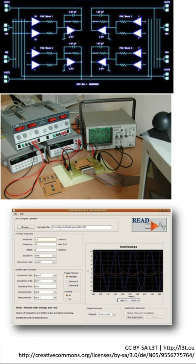

Online-Labore sind eine der innovativen Entwicklungslinien für Internet basierte Umgebungen in vielen Bereichen der Gesellschaft. In den zurückliegenden Jahren wurden erhebliche Fortschritte bei der Nutzung solcher Labore gemacht, speziell im tertiären und in den letzten fünf Jahren auch im sekundären Bildungssektor. Dies wurde durch die technische Weiterentwicklung des Internets (Bandbreite, mobiles Netz) ermöglicht. Vorreiter sind die Ingenieur- und Naturwissenschaften. Online-Labore haben aus folgenden Gründen große Bedeutung:

- wachsende Komplexität von Laborexperimenten,
- zunehmende Spezialisierung und Verteuerung von Ausrüstungen, Softwaretools und Simulatoren,
- Erfordernisse der Globalisierung und der zunehmenden Arbeitsteilung.

Aktives Lernen und Arbeiten mit Online-Laboren ist vor allem beim technologiegestützten Lernen und Arbeiten wichtig. Am Arbeitsplatz können weit entfernte Labore ohne zu reisen genutzt werden; Ausbildung, lebenslanges Lernen und Arbeit werden flexibilisiert.

Erstes, nachstehendes, Element wird ans Ende der vorherigen Seite gestellt

<figure>
  
  <figcaption>Abb. 1: Remote-Mikroelektronik-Entwurfs- und Messplatz an der FH Kärnten</figcaption>
</figure>

