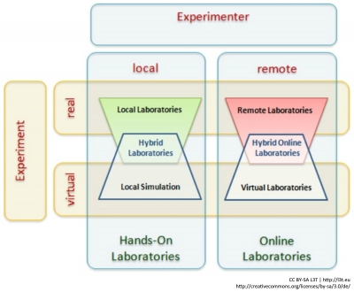

Ein kompletter Entwurfszyklus mikroelektronischer Schaltkreise (Design, Simulation, Hardware-Realisierung oder Messung) erfordert beispielsweise erhebliche systemtechnische und finanzielle Aufwendungen und ist daher nur von einigen wenigen Hochschulen für die Lehre realisierbar. Hier kann ein Online-Labor Abhilfe schaffen und den Studierenden und Lehrenden die Möglichkeit bieten, Laboruntersuchungen im Web durchzuführen.

<blockquote style="background: #B3E5FC; border-left: 10px solid #039BE5">

### !

Online-Labore sind wissenschaftliche Einrichtungen, mit denen mit Hilfe von Web- und Informationstechnologien Laboruntersuchungen durchgeführt werden können.

</blockquote>

An der Fachhochschule Kärnten ist ein solcher kompletter Zyklus mikroelektronischer Schaltkreise als Online-Labor realisiert und frei verfügbar. Die Nutzer/innen benötigen nur einen PC, ein Tablet oder ein Smartphone mit Webbrowser. In der Abbildung 1 sind das Simulationstool (oben), der Messaufbau mit Instrumenten (Mitte) und das Fenster für die Anzeige der Messergebnisse (unten) zu sehen.

Abbildung 2 zeigt die grundlegende Einteilung **unterschiedlicher Formen von Laboren** (Garbi Zuti et al., 2009). Betrachtet man jeweils den Standort eines Laborexperiments und den Aufenthaltsort der Benutzer/innen, dann ergeben sich die insgesamt vier gezeigten Labortypen.

<figure>
  
  <figcaption>Abb. 2: Klassifizierung von Laboren</figcaption>
</figure>

Remote und Virtuelle Labore werden als Online-Labore zusammengefasst. Zunehmend wichtiger werden Mischformen (Hybrid-Labore), in denen Simulation und anschließende praktische Erprobung integriert sind (siehe einführendes Beispiel oben).
