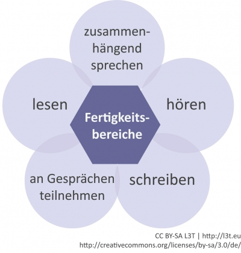

<!-- filename: 01_Einleitung.md -->
<!-- title: Einleitung -->

Im Zeitalter von Internet, Web 2.0 und mobilen Endgeräten sind moderne Technologien auch aus dem Bereich des Sprachenlehrens und -lernens kaum mehr wegzudenken (Nieweler, 2006). Besonders die Netzgeneration erwartet, dass Werkzeuge und Kommunikationsformen, die sie in ihrer Freizeit verwendet, auch für den schulischen Kontext nutzbar gemacht werden.

In einer globalisierten Welt kann Lernen und Lehren auf die unterschiedlichen Bedürfnisse und Voraussetzungen von Lernenden besser eingehen. Moderne Technologien eröffnen enorme Möglichkeiten für verstärkte Individualisierung. Sie machen Lernende räumlich und zeitlich weitgehend unabhängig und erleichtern selbstbestimmtes, autonomes, konstruktivistisches Lernen (Nieweler, 2006; Schmidt, 2005; vgl. Kapitel #lerntheorie). Für den Fremdsprachenerwerb und -unterricht ermöglichen sie neben leicht zu realisierender Informationsbeschaffung eine globale Vernetzung, weltweite Kommunikation und Kooperation und den Zugang zu topaktuellen authentischen Quellen und Unterrichtsmaterialien.

Der „Gemeinsame Europäische Referenzrahmen für Sprachen“ (GERS) definiert fünf Fertigkeitsbereiche, nämlich: „hören“, „lesen“, „zusammenhängend sprechen“, „an Gesprächen teilnehmen“ und „schreiben“ (ÖZG, 2009, 10; siehe Abbildung 1), die sich, wie auch Abbildung 1 zeigt, in konkreten Kommunikationssituationen überschneiden und somit nach Möglichkeit auch integrativ und nicht isoliert gelehrt und gelernt werden sollten.

<figure>
  
  <figcaption>Abb. 1: Die Fertigkeitsbereiche für Sprachkompetenz des Gemeinsamen Europäischen Referenzrahmens für Sprachen</figcaption>
</figure>

Dieses Kapitel wird zunächst über den (möglichen) Technologieeinsatz beim Sprachenlernen berichten und sich dabei an der Struktur des GERS orientieren. Im Anschluss werden Projekte wie das europäische Sprachenportfolio beschrieben, Webangebote für Lernende und Fortbildungsangebote für Lehrende genannt und abschließend ein konkretes Beispiel für die Anwendung im Schulunterricht gegeben.

<blockquote style="background: #B3E5FC; border-left: 10px solid #039BE5">

### !

Die URL von diesen und allen weiteren im Kapitel genannten Angeboten finden Sie bei [diigo.com](http://www.diigo.com) unter den Schlagworten #l3t und #sprache.

</blockquote>
