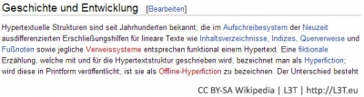

Im Wikipedia-Artikel zum Begriff Hypertext findet sich zu Beginn ein  
Inhaltsverzeichnis, das sieben Einträge mit Links zu sieben Knoten anbietet, die durch  
blaue Farbe als anklickbar herausgehoben werden:

Abb. 1: Screenshot des Wikipedia-Artikels „Hypertext“. Quelle: (Stand 09/2010)  

Klickt man mit der Maus auf die Zeile „3 Geschichte und Entwicklung“, so landet man bei folgendem Text im selben Wikipedia-Artikel:

<figure>
  
  <figcaption>Abb. 2: Screenshot des Wikipedia-Artikels „Hypertext“. Quelle: (Stand 09/2010) [http://de.wikipedia.org/wiki/Hypertext](http://de.wikipedia.org/wiki/Hypertext)</figcaption>
</figure>

<blockquote style="background: #B3E5FC; border-left: 10px solid #039BE5">

### !

Heute werden Hypertexte mit Hilfe der Auszeichnungssprache HTML (HyperText Markup Language) aufbereitet. Mit HTML können Texte aber nicht nur stilistisch aufbereitet werden (Zeichensätze, Stile, Größen), sondern sie können auch Sprungmarken („Anker“) und Sprungadressen aufnehmen, die man als Links oder Hyperlinks bezeichnet, und die zu anderen Texten (als Knoten bezeichnet) führen.

</blockquote>

Solche Sprungadressen können zu anderen Stellen im selben Text, zu anderen Seiten derselben Webseite, zu Dateien oder gar zu anderen Webseiten führen. Links sind nicht auf Begriffe und Textstellen beschränkt, sondern können heute auch von Bildern und Filmen ausgehen oder zu Bildern und Filmen führen. Zuständig für die Weiterentwicklung von HTML ist heute das World Wide Web Consortium (W3C).

<figure>
  
  <figcaption>Abb. 3: HTML-Code des Kastens „Inhaltsverzeichnis“ aus Abbildung 1. Quelle: (Stand 09/2010) [http://de.wikipedia.org/wiki/Hypertext](http://de.wikipedia.org/wiki/Hypertext)</figcaption>
</figure>

