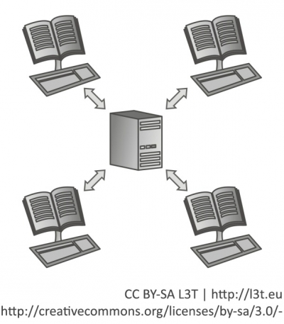

In diesem Abschnitt wird der Begriff des Informationssystems erläutert und was man im Lehr-/Lernkontext darunter versteht. Anschließend erfolgt ein Überblick über die Verteilungsmöglichkeiten derartiger Systeme in Computernetzwerken.

## Informationssysteme zum Lernen und Lehren

Ganz allgemein sind Informationssysteme eben jene, die Informationen verarbeiten, genauer: sie unterstützen die Nutzerinnen und Nutzer bei der Erfassung, Übertragung, Transformation, Speicherung und Bereitstellung von Informationen verschiedenster Art (Ferstl&amp;Sinz, 2006, 1). Daher bestehen Informationssysteme aus der Gesamtheit aller *Daten* und den nötigen *Verarbeitungsanweisungen*. So gesehen bilden die Server des World Wide Web das weltweit größte Informationssystem. Informationssysteme, die speziell für die Organisation und Durchführung von Lehr- und Lernprozessen entwickelt worden sind, verarbeiten ebenfalls Informationen, nämlich die, die zur Erstellung und Verwaltung von Lernressourcen benötigt werden.

<blockquote style="background: #B3E5FC; border-left: 10px solid #039BE5">

### !

Informationssysteme für das Lernen und Lehren verarbeiten die Informationen, die für die Erstellung und Verwaltung von Lernressourcen benötigt werden.

</blockquote>

Die Verarbeitung der Informationen kann dabei auf dem eigenen Computer stattfinden. Häufiger werden jedoch Dienste über Netzwerke in Anspruch genommen, die auf eine zentrale Datenbank zugreifen und diese Daten für die Benutzerinnen und Benutzer grafisch sinnvoll darstellen. Dadurch wird nicht nur das Halten größerer Datenmengen, die zentrale Sicherung, die Ausfallsicherheit und die Bereitstellung höherer Rechenleistung möglich, sondern auch die Kommunikation zwischen den Benutzerinnen und Benutzern. So können beispielsweise die Lernenden bei Rückfragen mit den Kursleiterinnen und Kursleitern oder mit anderen Kursteilnehmerinnen und Kursteilnehmern in Kontakt treten.

<blockquote style="background: #FFEBEE; border-left: 10px solid #F44336">

### ?

Bitte ergänzen Sie zur Tabelle 1 Beispiele für die Verarbeitung von Informationen, die von Informationssystemen zum Lehren und Lernen bereitgestellt und/oder unterstützt werden sollen.

</blockquote>

Funktionen Beispiele (Musterlösungen) Informationen erfasste Lerndaten in Datenbank schreiben, neue Kursdaten einstellen, Lerninhalte erstellen Informationen übertragen Lerndaten bei Einschreibung im Kurs zur Verfügung stellen, Termine aus dem Kurskalender in die persönlichen Kalender der Lernenden überführen Informationen transformieren Reports aus Lernergebnissen erstellen, Bildgrößen für Darstellung anpassen, Vorlagen anwenden Informationen speichern Lernergebnisse ablegen, Lerninhalte speichern Informationen bereitstellen eingeschriebene Kursteilnehmer/innen, Testergebnisse

</blockquote>

Tab.1: Informationen, die von Informationssystemen zum Lehren und Lernen bereitgestellt werden

## Netzwerkarchitektur für Informationssysteme — ein Überblick

Zum selbstständigen Lernen können Lernmaterialien auf CD, auf einem USB-Stick oder einem anderen Datenträger bereitgestellt werden. Lehrende und Lernende müssen sich dann keine Gedanken über Internetverbindung und Netzwerkarchitektur machen, haben aber auch keine Möglichkeit, miteinander zu kommunizieren oder Gruppenarbeiten durchzuführen. Soll mehr als ein/e Benutzer/in mit dem Informationssystem arbeiten, folgt unweigerlich die Frage, wie die Zusammenarbeit realisiert werden kann. Genauer: Wie kann man erreichen, dass alle Benutzer/innen Zugriff auf das Informationssystem und die darin befindlichen Daten haben? Ein erster und sehr einfacher Ansatz wäre es, alle Computer der Nutzer/innen miteinander zu verbinden. In einem solchen *Peer-to-Peer-Netzwerk* wären alle Nutzer/innen direkt miteinander gleichranging vernetzt und tauschen Informationen untereinander aus (Stein, 2008, 489).

<figure>
  
  <figcaption>Abb. 1: Peer-to-Peer-Netzwerk</figcaption>
</figure>

<blockquote style="background: #B3E5FC; border-left: 10px solid #039BE5">

### !

In einem Peer-to-Peer-Netzwerk sind alle Computer gleichrangig miteinander verbunden und tauschen Informationen und Dienste untereinander aus.

</blockquote>

Das Problem hierbei ist, sicherzustellen, dass auch alle Informationen zu jeder Zeit verfügbar sind – auch dann, wenn die Benutzer/innen ihren Computer ausschalten. Würde man also ein Informationssystem zum Lernen und Lehren in einem solchen Netzwerk realisieren, müsste man entweder

- damit rechnen, dass einige Informationen und Dienste nicht immer erreichbar sind, oder
- es müssten die gleichen Informationen auf mehreren Computern hinterlegt werden, was enorme Anforderungen an die Versionsverwaltung stellen würde, nur um sicher zu gehen, dass alle mit den aktuellen Informationen arbeiten (Niegemann et al., 2008, 459f.).

Aus diesem Grund sind die meisten Informationssysteme *Client-Server-Anwendungen*. Durch die Installation des Informationssystems auf einem zentralen *Server* ermöglicht man es allen Nutzerinnen und Nutzern, gemeinsam auf die dort gespeicherten Informationen und Dienste zugreifen zu können. Da die Arbeit mit dem Informationssystem mittlerweile häufig über den Internetbrowser erfolgt und selten eine spezielle Zugriffssoftware benötigt wird, benötigen die Anwender/innen-PCs (*Clients*) oft lediglich einen Zugang zum (globalen) Inter- bzw. firmeneigenen Intranet (Niegemann et al., 2008, 458f.).

<figure>
  
  <figcaption>Abb. 2: Client-Server­Architektur</figcaption>
</figure>

<blockquote style="background: #B3E5FC; border-left: 10px solid #039BE5">

### !

In einer Client-Server-Architektur stellt ein zentraler (Groß-)Rechner, der sogenannte Server, Daten und Dienste für die Nutzer/innen zur Verfügung, die mit ihren Computern (Clients) über das Inter- oder firmeneigene Intranet darauf zugreifen können.

</blockquote>

Am deutlichsten spürt man bei Client-Server-Architekturen, wenn der Server überlastet ist. Das heißt, wenn zu viele Zugriffe zur selben Zeit bearbeitet werden sollen. Es muss daher stets darauf geachtet werden, dass genügend Rechenleistung zur Verfügung steht. Hierfür muss die Zahl der Benutzer/innen abgeschätzt werden, die gleichzeitig die Dienste des Servers in Anspruch nehmen möchten. Hieran sollten Hauptspeichergröße, Prozessorleistung und Festplattengeschwindigkeit des Servers angepasst werden (Niegemann et al., 2008, 160f.). Des Weiteren ist zu überlegen, wie ausfallsicher der Server in Bezug auf Verfügbarkeit und Zuverlässigkeit sein soll. Systeme, bei denen eine hohe Verfügbarkeit wichtig ist, werden in der Regel als Cluster ausgeführt, das heißt, der „Server“ besteht aus mehreren, miteinander vernetzten Rechnern. Der Ausfall eines Cluster-Rechners stört den Gesamtbetrieb im Idealfall kaum. Zuverlässige Systeme verfügen außerdem über eine (hoch-)redundante Datenspeicherung, sodass der Ausfall einzelner Festplatten und damit verbunden deren Reparatur im laufenden Betrieb durchgeführt werden kann, ohne die Aufgaben des Clusters zu beeinträchtigen. Ein einzelner Server kann zudem nicht beliebig aufgerüstet werden und so von vornherein nur eine gewisse maximale Anzahl von parallelen Benutzerinnen und Benutzern bedienen. Bei einer Cluster-Lösung können dagegen bei Bedarf weitere Rechner hinzugefügt werden, um den Betrieb bei hoher Benutzer/innen-Zahl zu gewährleisten.

### In der Praxis: Schwankungen an Hochschulen

In Hochschulen gibt es erfahrungsgemäß zwei Zeiträume im Semester, an denen die Anzahl von Benutzer/innen von zentralen Informationssystemen besonders hoch ist: zu Beginn des Semesters zur Einschreibung in die Lehrveranstaltungen und am Ende zur Einschreibung in die Klausuren. Da die Zahl der eingeschriebenen Studierenden von Semester zu Semester stark schwanken kann (zum Beispiel durch geburtenschwache/-starke Jahrgänge), sollte immer wieder geprüft werden, ob die verfügbare Rechenleistung des Servers noch ausreichend ist oder ob gegebenenfalls aufgestockt werden muss. Eine gute Strategie ist es auch, die Termine für die Einschreibungen nach Fakultäten, Lehrstühlen oder Fächern zu staffeln und die Zugriffe so zeitlich zu verteilen.

</blockquote>

<blockquote style="background: #FFEBEE; border-left: 10px solid #F44336">

### ?

Vergleichen Sie Peer-to-Peer- und Client-Server-Architekturen miteinander. Eine mögliche Lösung finden Sie in Tabelle 2. Wie unterscheidet sich Ihre Darstellung davon?

</blockquote>

Kriterien Peer-to-Peer (Musterlösungen) Client-Server (Musterlösungen) Dienste und Informationen liegen (hauptsächlich) auf dem Anwender/innen-PC dem Server Zum Aufbau des Netzes muss zusätzliche Hardware angeschafft werden nein (bei aktueller PC-Grundausrüstung) Ja, der Server Erweiterbarkeit Mit jedem neuen PC, wird aber zunehmend unübersichtlicher und langsamer Neue Hardware für Server Vorteile

- schneller Aufbau
- relativ kostengünstig

- Zentrale Steuerung, Datenhaltung

Nachteile

- die Verfügbarkeit aller Daten kann nicht gewährleistet werden (abhängig davon, welche Knoten gerade online sind)
- keine zentrale Datensicherung
- Versionsverwaltung schwierig
- Datensicherheit problematisch

- Bei Problemen oder Überlastung kein Zugriff auf Daten
- Kosten für Server, Installation, Laufzeit und Wartung

Beispiele für Anwendungen

- Instant Messaging (zum Beispiel ICQ, Skype)
- File Sharing

- Social Media
- Lernmanagementsystem

</blockquote>

Tab.2: Peer-to-Peer- und Client-Server-Architekturen im Vergleich

Als ein Architektur- und Service-Modell hat sich zudem *Cloud-Computing* etabliert. Hierbei wird kein einzelner Server, sondern ein flexibel erweiterbares Cluster aus mehreren Servern herangezogen, auf denen die Anwendungen ausgeführt werden (Guoli&amp;Wanjun, 2010). Rechenleistung und Speicherkapazität können dabei durch das Hinzunehmen weiterer Server stets bedarfsgerecht angepasst werden.
